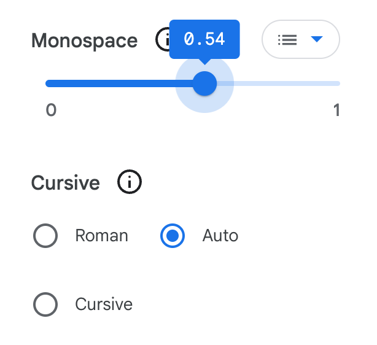
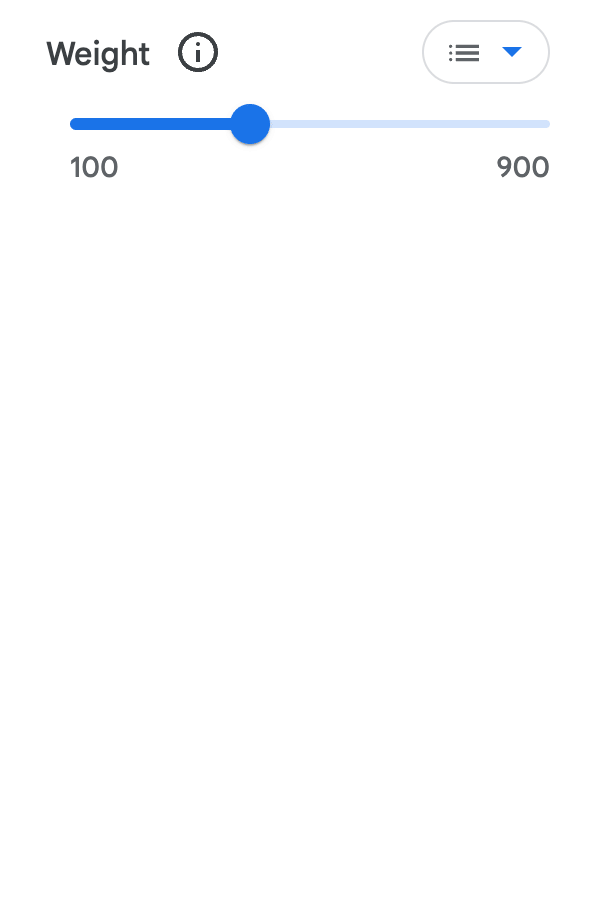

<link href="style.css" rel="stylesheet">

<a href="./index"><button class="button button-i">&larr; GF Guide Index</button></a>

# Axis Registry Protocol
{:.no_toc}

🕷 Type designers are familiar with the five axes already defined by Microsoft in the OpenType specification. However, for each new variable font that type designer develops, it often introduces new axes. In order for a family introducing new custom axes to be added to the Google Fonts API and Catalog, each axis it offers must be “registered” – it must have a definition in the <a href="github.com/googlefonts/axisregistry" target=_blank> GF Axis Registry</a>. 
  
The requirements and principles of axis definition have been established mainly by a cross-functional group of fonts team members by Q3 2022. This protocol provides a guide to handling it within the font project as part of the onboarding process to Google Fonts. It offers detailed information on the required information, how to define it, and the required steps.

    Background reading: 
    <mark class="green"><b>must&rarr;</b></mark> <a href="./variable" style="font-weight:bold">Variable fonts specifics</a>

## Table of contents
{:.no_toc}
* TOC goes here
{:toc}

## Overview

Discovering innovative ways to use technology is at the core of OpenType Font Variations. The format opens the possibility to all sorts of combinations of shape changes controlled under the new font capabilities. With this big encouragement to creativity, it is common for type designers to think they could just come up with new axes all the time, but **Google's position is that there should be efficiency of resources whenever they could be applied**. If three fonts can use the same axis, that is preferable to having three different axes. 
  
The “Don’t Repeat Yourself - DRY” principle from software development comes at hand to understand the benefits of avoiding duplications to reduce contradictions, miss-implemented code, and potential developer confusion.
  
From selecting the axis name, tag, or description, to the type of range, *it's always necessary to find a balance between the current project demands and the further uses the axis could have*. Thus, the reusability principle and keeping the end-user at the center of the decisions become essential to make it simpler and easier to understand, select and use the fonts and their axes.
  
This protocol covers the end-to-end process of discussing, reviewing, and uploading new axes and attempts to mitigate possible causes of conflict, such as:

-   **Repeated, redundant or overlapping behaviors.**
    We want to avoid registering more than one axis for each kind of variation, and make axes as widely reusable as possible while still being specific enough to know what to expect from the name and range values.

-   **Semantic conflicts over axis names, tags or named instances.** 
    Especially important when producing instantiated static fonts.

-   **Range definition conflicts.** 
    If definitions are too specific to the initial typeface project, they can lead to redundant axes

-   **Slow axis registration processing.**
    When GF is slow at ratifying axes in our registry, the more entrenched the pre-registration usage becomes, disincentivizing changing or forking typeface projects for registration

## Protocol

The following are the required steps to register a new custom Axis into Google Fonts Axis Registry

### 1. Validate the incoming custom axes against the Axis Registry. 
    
The first step required is to inspect the current [GF Axis Registry](https://github.com/googlefonts/axisregistry/tree/main/Lib/axisregistry/data) and the [Knowledge/Glossary](https://fonts.google.com/knowledge/glossary#a-d) page (search for "axis") to determine if there is already a custom axis that could be used for the variation purpose on the font. We should ensure it is not a duplicated concept. Then according to the findings:

-   **1.1. A registered axis matches the function but not the name of the incoming Axis** ⇒ Change the name and values of the custom axis in the project’s source file to match the already registered axis.

-   **1.2 A registered axis matches the function and name but not the range values of the incoming axis** ⇒ Additional range values could be added (see 2.)
  
-   **1.3 A registered axis matches the function and name but not the type of values or fallbacks of the incoming axis** ⇒ Register a new axis (See Axis Requirements below.) 
  
However, this option is strongly discouraged and should be the last case scenario. A good example could be the *Casual* axis. Although its name, description, and range could fit in many other cases, it was originally registered with fallbacks called *Linear* and *Casual*, which the API will use to generate those static fonts for every font using the axis, even if does not make sense for those projects. Here lies the importance of point 3.1.4.
 
> Note: Casual is among the first axes included in the registry when the support of the custom axis was being implemented. This document would be the right place to offer apologies for the first axes registered in ways we know now they bring this type of inconvenience.

-   **1.4 The incoming axis doesn't match any currently registered axes** ⇒ Register the new axis (See Axis Requirements below.)

### 2. Modify the current axis registry to cover the needs of the incoming font. 

Derived from case 1.2. If a registered axis matches the function and name but not the range values of the incoming axis, then the following could be applied.

- The axis range can be increased if a family requires wider range values. 
- The type of value can’t be changed (e.g. Boolean to ranges.)
- If the default value of the new font does not match the registered axis default it can be overridden on the family `METADATA.pb` file, it must not be modified in the axis registry. Refer to the `default_value` in the *Axis Requirements* section of this document.

### 3. Registering a new custom axis 

Derived from 1.3 and 1.4. If there is no other registered axis that matches the needs of the upcoming axis, then a new axis should be registered. Read the below contents with details on the Axis Requirements and the process to include it.

## Axis Requirements

The following are the requirements for a new custom axis to be registered, with expanded details about the <a haref="https://github.com/googlefonts/axisregistry#axis-metadata-fields" taget=_blank>Axis Metadata Fields</a> that should be included in the `.textproto` file for the axis.

- #### An existing font project introducing the axis
There should be a production-ready VF project with the new axis. Axes can't be defined up front without a variable font family that requires the axis.

- #### The axis `display_name` should be readable
When choosing a name for the axis the semantics matter. Axes should represent intuitive reusable concepts that can (and do) appear in many families. 
  - There should be a balance to be found between over-general to the point you can't predict what will happen, and over-specific to the point every family has unique axes. 
  - The `display_name` should be precise and descriptive enough to convey its effect on the font while avoiding use of highly technical terms. All the parametric axes would be a good example of this. The technical name *Y Transparent Ascender* is abbreviated with the *YTAS* tag, but the display name is `Ascender Height`, which is a familiar term for end-users. 
  - Nouns are often preferred to adjectives as they are words that commonly define larger concepts that allow related ideas to be defined under adjectives as instances. For example a hypothetical "Happiness" axis could have *Charming, Amused, Glad, Cheerful* instances. However, the rule of thumb when deciding on a name should be the one that makes the most sense to communicate effectively to end users.
  - No misspellings, no puns, or the other DEI (Diversiti, Equity and Inclusion) banned word list should be used.
  - The spelling should follow the Title Case. <a href="https://m3.material.io/" target="_blank">M3 Material Design</a> uses Title Case for axis names as they are proper nouns, we should be consistent.
  
- #### The axis `tag` is key in the font file name.
The `tag` is used to specify an axis in font-variation-settings, CSS API requests, and in font file names to specify which axes are included in the font, e.g. `Fraunces[SOFT,WONK,opsz,wght].ttf`
  - They are conditioned to four letters in length; ideally, they should work as an abbreviation or an acronym, trying to transmit the meaning of the axis as much as possible. However, sometimes the letter limitation makes it hard to comply.
  - It is suggested to use two letters per word for two-word axis names, and already used abbreviations should be consistent across axes. For example, if 'SH' was selected to abbreviate 'Shape,' it should be used only whenever possible.
  - The spelling should be in all CAPS.

- #### Defining the type of axis and range values wisely
As with the name definition, the axis' type of value should be reusable. It should both serve the particular needs or uses of the project submitting the axis and try to anticipate the possible ways it could be used for other projects (See [Type of axis](https://googlefonts.github.io/gf-guide/axis-registry.html#types-of-axis))
  - Defining an axis as a Boolean might not be valid for further font project needs, as is happening now with Wonky axis.
  - Ranges that are overly narrow or too wide would leave either insufficient room for the inclusion of other steps or too much to create meaningless intermediate steps. As an example, YEAR axis original range was including only the period covered by the original project (1979-2050). The range was redefined to a broad scope that could support other projects using the axis (-4000 — 4000).
  - The following values must be included
    - **`min_value`** The lower bound of the axis. Inclusive.
    - **`max_value`** The upper bound of the axis. Inclusive. 
    - **`default_value`** Default position of the axis.
        The default value should work as a reference. It is possible to override it in the family `METADATA.pb` file so that the axes keep their reusable purpose. Please refer to the <a href="https://googlefonts.github.io/gf-guide/metadata.html#registry_default_overrides" target=_blank>registry_default_overrides</a> entry under the Metadata file section for details on this process.
    - **`precision`** Describes the specificity at which an axis position can be specified. 
        For example, 0 means values must be specified as whole numbers while -1 means values can be as precise as one decimal place. A percentage axis going from 0 -- 100 with a precision value `0` allows one hundred accessible intermediate positions, while a value `-1` would determine one thousand positions 0.0 -- 100.0.

- #### A `fallback` at the axis default value
For server implementation reasons, new custom axis registries require to include one single fallback. It must be called `Default` (reserving the use of  “Regular” for Weight and “Normal” for Width axes) and the value should match the axis `default_value`.

- #### The `fallback_only` field affects the way the type tester surfaces the axis control.
It determines whether only the fallback positions should be used. 
  - `false` value is used for a continuous range axis displaying a slider to reach all the intermediate points
  - `true` value would be used in cases like `Italic` Boolean axis to display an "on/off" toggle, or `Cursive`, a pseudo Boolean which was registered with three fallbacks positions, and so it uses radio buttons to give access to those positions. However, as stated in the *Type of Axis* section, binary and pseudo-Boolean axes are expected to be avoided or rather exceptions.

    <figure>
    
    <figcaption>The slider and radio buttons used on the type tester page.</figcaption>
    </figure>

- #### The axis `description` helps to define its functionality in a broad sense
A short description of the axis is used on the Type Tester tab of the font specimen page, under the tooltip (i) next to the axis name to give users more context about what the axis does or how it can be used. It should be written in a general way allowing it to make sense for other cases, not pointing too specifically to the font introducing the axis, and including a clarification of the range. It should be a maximum of 350 characters.
    <figure>
    
    <figcaption>Axis description and image are displayed under the tooltip (i)
     in the Type Tester tab of the font's specimen page</figcaption>
    </figure>

 

## Types of axis

Identifying and selecting the accurate type of the axis is crucial for the axis definition. The type of range and its values play a key role in communicating a better sense of the purpose and use as well as the reusability of the axis.

### Continuous Range axes 

Commonly percent (0..100) or “per mille of em” (0..1,000). Within ranges, two subcategories could be defined: Relative and Absolute.

#### Relative range axes

The default is usually always the same, e.g. 400 wght, 100 width, 0 mono. 
For new expressive axes, the default range for these is likely to be a percent range 0..100, and probably with a 0 precision value (meaning no decimal places). The default might be 0, 50 or 100 depending on if the axis is adding something that usually isn't used, something that usually is used but can be turned up or down, or something usually used that can be removed. Width is unusual as a relative percent range, as it has 100 as default and goes up and down from there.

  - **Binary, pseudo Boolean** (0, 1 but with a range 0.00..1.00)
Few binary axes have been registered as pseudo Boolean behavior with off and on positions but with two or three decimal places allowing a range. The difference with a percent (0 to 100) range would be semantic, related to the amplitude of variation that an axis expresses. Going from 0 to 1 with decimals could be interpreted as how much of the completeness of a single unity/entity it represents. In contrast, the percentage understanding implies the possibility of defining many stops that suggest different concepts within the range.
  
<a href="https://fonts.google.com/knowledge/glossary/fill_axis" target="_blank">Fill</a> is a good example of this axis where the numbers indicate proportion filled, from 0 (no treatment) to 1 (completely filled). Another pseudo Boolean case <a href="https://fonts.google.com/knowledge/glossary/cursive_axis" target="_blank">Cursive</a>, an axis with the same binary definition of on and off but with an intermediate point "auto" at 0.5 that would add a third behavior option allowing it to change automatically according to another axis that conditions it.

Going forwards, we would like to see the registry more consistent. Most of the upcoming axes are likely to be Relative ones with a percent range since users are more accustomed to thinking about things in terms of percentages (particularly for technical stuff) and more comfortable with integers than decimals. Hence, **pseudo-Boolean axes are expected to be avoided or rather exceptions**.

#### Absolute range axes

When the value corresponds to some measurement of the font, often a specific length of a specific form of a specific reference glyph. For example the distance from the bottom to the top edge of the extrusion of a 3d-looking typeface like <a href="https://fonts.google.com/specimen/Nabla" target="_blank">Nabla</a>, which is the same on every glyph, but the square edges of "H" are a good reference; or the Font Bureau Parametric Axes like <a href="https://variationsguide.typenetwork.com/#yopq" target="_blank">Y Opacity (YOPQ)</a> which measures the bottom to top edges of the bar of the "H." 
  
The default range of these axes is typically "per mille of em", 0..1000. Most fonts use a UPM of 1000, so there is a 1:1 map between the "font units" the type designer draws with and the "slider units" the design app user interacts with. If the font uses another UPM, say 2048, which is the original default for TrueType fonts, the font units can be easily scaled/normalized.
  
*Per mille* values not only have 100s of years of history in typography, but also the (mental) arithmetic is more straightforward. For example, if you want to make a 2pt rule and adjust the typeface so that at 36pt size the bar of the 'H' is 2pt and the size of the extrusion is also 2pt, with the axes mentioned above.
  
Absolute axes, by their nature, have no meaningful per registry/library default because the default value is unique to each font's default instance's reference glyph shape's measurement. In these cases, the default value required could be set to zero, and it will always need a per family default override. Refer to the `default_value` in the *Axis Requirements* section of this document.

## Axis registering process

### Creating an Axis Proposal issue. 

- Create an issue using the Add-Axis template in <a href="https://github.com/googlefonts/axisregistry/issues/new/choose" target="_blank">googlefont/axisregistry</a> repository providing the required the axis information including:
    - All the axis metadata fields drafted taking the above *Axis Requirements* into account.
    - An expected case of use from the user’s point of view. It would be a “Why do we need this” section, reasoning on why or how the users might use it. This explanation would help to discern the validity of the axis itself and its definitions such as the ranges, a concern that has arisen when reviewing new axes (e.g. discussing Year, HEXP/ TRACK). 
     
    This information will also help to create the additional educational content required (detailed below.) 
    - An image (GIF or video) showing the effect of the axis in the font.
- The reviewing process (discussion and decisions) of the proposed axis and its metadata fields should happen on the issue before creating the PR for the axis inclusion. Do not create a PR simultaneously as the proposal issue to avoid having the discussion take place in two different places making the process slower and harder to follow and conclude.

### Creating a Pull Request for the new axis

- After creating the Issue proposal and all the metadata fields have been reviewed/discussed/agreed upon, you could create a PR on the <a href="https://github.com/googlefonts/axisregistry" target="_blank">googlefont/axisregistry</a> repository with a new `.textproto` file for the axis, including all parameters as defined in the *Axis Requirements* and agreed in the proposal issue. 
 
    - The <a href="https://github.com/googlefonts/gftools/blob/main/bin/gftools-add-axis.py" target="_blank">add-axis</a> from gftools will help create the `.textproto` file taking the font that introduces the axis as an argument. 
    - Process the PR for the new axis as done with fonts: merging ⇒ Dev server ⇒ Sandbox server ⇒ Production server. The PR should reach the Production server at least one week before the font's PR is merged. For details on this process please refer to the <a href="./onboarder-workflow.html">Onboarder Workflow Guide</a>.
    - The additional educational assets needed for the axis (see below) could be included following the font publishing.
- Once the final PR is merged into `googlefont/axisregistry` then pull the subtree on `google/fonts` to incorporate the newly added Axis. Please refer to the <a href="https://googlefonts.github.io/gf-guide/googlefonts.html#axis-registry">Axis Registry</a> entry under the *google/fonts Repository Explained* section for details on this process.

### Creating educational assets

Every custom axis included in the GF Axis Registry should have an entry in the [Knowledge/Glossary](https://fonts.google.com/knowledge/glossary#a-d) page to provide more expanded information on the axis.

Therefore, additional educational information should be created to communicate more details on the axis concept and use. These assets could be added after the font family introducing the axis is pushed to Production.

- Illustration of the axis behavior following the <a href="https://www.figma.com/file/I4dDT3xB25t0kEK4YgWzP7/GFK-illustration-template-%2B-style-guide?node-id=103%3A2" target="_blank">GF Knowledge Illustration style guide specifications</a>. This image shows up in the tooltip *information* (i) next to the axis name in the Type Tester tab of the Specimen page of the font and will be also used for axis entry in `Knowledge/Glossary`.
  - For the image to be produced by the Knowledge Illustrator, the onboarder in charge of the axis inclusion should provide:
    - The font family using the axis
    - Indicate the instance location for the left and right sides of the image. 
    - The type of axis and how big the range is (small, medium, large)
    - The word to be displayed (it should be either a random word or illustrative word, not the axis name and not the font family name).
 - A glossary entry that provides details about the metadata fields and their CSS applicability. The onboarder in charge of the axis inclusion should provide a bullet list of ideas for the Knowledge Content Editor to write it. If the onboarder can’t provide the details Dave Crossland would do it. 

## Foreseeable scenarios

Over time, following the avar2 table development, it is expected type designers will combine the axes in many ways to create synthetic ones and make, for example, the OpenType features as variation axes.

This would allow for the user to choose things like the size or thickness of features like Old Style Figures or Small Caps. This approach would also reduce the file size as the data for these axes does not exist; they are composed of the combination of other axes. Roboto Flex is 1.8 Mb, but Roboto Flex with avar2 Is approximately 300 Kb, an 80% file size savings.

Eventually, the registry of those synthetic axes should follow the same protocol for their inclusion.

Similarly, eventually, *Stylistic Sets* could become a variation axis since for them to interact with another axis, they had to be an axis of their own. That is the case for the Wonky axis, which is an axis controlling glyph substitutions, but being it an axis it can interact with the Optical Size axis to activate it at its discretion.

<!-- Glossary (to-do)

Knowledge Illustrator
Knowledge Content Editor -->

## Named and fallback positions

Some fonts provide named positions on a custom axis.  For example, the Element Shape in Handjet defines different shapes at each integer value along the axis (Triangle, Square, Lozengue, etc) and Kablammo’s design is centered around four named positions on a custom axis. 
<!-- Without named positions, Kablammo’s design center "gets lost". Ideally, the named positions would be available to the fonts.google.com Type Tester as a dropdown.  It may also make sense to use the named positions when creating a download zip. -->

Named positions are similar to, but different than, fallback positions. Fallback positions were originally defined for the legacy axes, width and weight, to cover the axis values that matched the pre-VF world. Google Fonts creates static instances at each of the fallback positions and delivers them when a requester does not support VFs.  For example, when wght=451 is requested by a non-VF client, Google Fonts could deliver weight 500.

Additionally, fallback positions are defined on the axis and not on the font with the expectation that all fonts that support an axis will want the same fallback positions (very reasonable for legacy support). 

All this makes fallback positions unsuitable for named positions, and have been reserved to the Microsoft OpenType registered axis (and will remain for the custom axis already registered in GF registry)

Named positions are not yet supported. For the time being, fonts will be published and delivered only in VF format without Named Positions and therefore without static companions on the downloadable zip file.

------------------------------------------------------------------------

## Useful links

These are some links where you could find more detailed information about this Culture:

-   OpenType Specification [Registered axis tags](https://learn.microsoft.com/en-us/typography/opentype/otspec191alpha/dvaraxisreg_delta#registered-axis-tags)
-   Font Bureau OpenType 1.8 [Variations Axes Proposal](https://variationsguide.typenetwork.com/)
-   [fonts.google.com/variablefonts](https://fonts.google.com/variablefonts)
-   Axis Registry [active issues in the repository](https://github.com/googlefonts/axisregistry/issues)
-   2017 [MS guide to axis registration](https://github.com/microsoft/OpenTypeDesignVariationAxisTags)
-   Font Bureau [Proposal summary for Grade axis](https://github.com/FontBureau/Opentype-1.8-Axis-Proposal/blob/gh-pages/proposal/Grade/ProposalSummary.md) 

    Further reading: 
    <mark class="brown">team&nbsp;</mark> <a href="./metadata">METADATA file</a>

