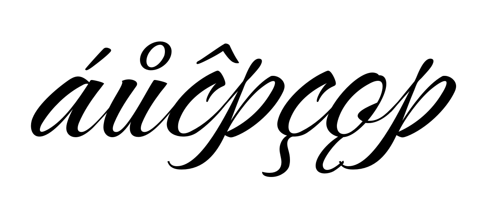
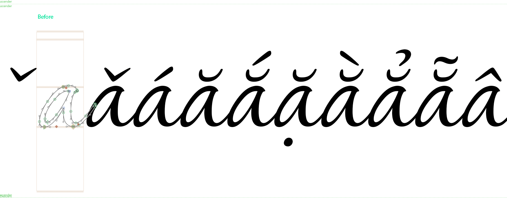
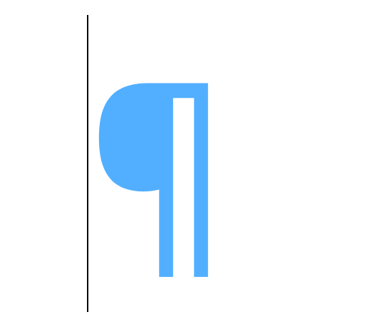

<link href="style.css" rel="stylesheet">

<a href="./index"><button class="button button-i">&larr; GF Guide Index</button></a>

# Diacritic marks
{:.no_toc}

<div class="callout">

🐳 A diacritic is a mark used in combination with a base letter for many purposes, such as modifying the pronunciation by extending a basic alphabet to include more phonemes; adding stress that could differentiate similar words, hence meanings; and, in some languages, adding or modifying a vowel in a word.
<br><br>
Many diacritics are separated from the base letter, and can be placed above, below, aside, or through it; while other diacritics connect to the base. 
<br><br>
This guide will give users an overview introduction to diacritics both from a design and technical perspective that will help them avoid the most common problems when shaping texts.

</div>

<div class="context-reading">
    Background reading:<br>
    <mark class="green"><b>must&rarr;</b></mark> <a href="https://googlefonts.github.io/gf-guide/requirements.html#glyphsets)" style="font-weight:bold">Overall font files requirements/Glyphsets</a>
</div>

## Table of contents
{:.no_toc}
* TOC goes here
{:toc}

## Design considerations

- **Diacritics must be coherent and harmonious with the general design of the font.** Take care of details like construction, contrast, thickness, stroke terminal shapes, slope, etc.
- **The marks should also be consistent among themselves.** Related forms like `acute`, `grave` and `circumflex` should share the design decisions as per the above.
- **It is suggested that you design the diacritical marks with the most strict users in mind.** This means respecting conventional contemporary shapes and sizes, and not reusing or interchanging the forms of different diacritics. (For example, a `breve` should not be reused as a `caron`.)
- **Pay attention to the proportion requirements.** There are some marks (for example, the `horn`) which, once combined with the base letter, will blend into the base and resemble an integral part of it.
- **Compound letters must be perceived as a whole.** The distance to the base letter is crucial and can affect legibility. If the mark glyph is too close to the base font, it could appear to collide with the base letter, adding darker spots to the line of text, especially at small sizes. If the mark is too far from the base letter, they would appear separate, making the reading process difficult.
- **The horizontal position is also essential for readability.** In Latin script, the symmetric marks are placed in the optical center of the base letter while the asymmetric ones follow other rules. (Note that the optical center is often distinct from the mathematical center.) But remember, they must be seen as a unity, so they must not be separated or detached from the base letter.
- **In Latin script, it is expected that all marks share the same distance to the base letter.** For particular cases like script fonts where the x-height could vary, marks should at least appear to be at the same optical distance to the base letter.
- **Idiosyncratic or decorative brands have given way to more universal or neutral forms.**
- **Ensure creating all the combining marks required for the languages the font are supporting**, as well as the so-called "Legacy Marks". (See below.) Google Fonts requires at least the GF Latin Core as the minimum set for a font addressing the Latin script. Please read more about our <a herf="https://googlefonts.github.io/gf-guide/requirements.html#glyphsets">Glyphsets</a>.
- **Usually, the design of the diacritics needs to be adjusted in size or slope to work better with the uppercase letters**. So ideally there should be at least two sets of diacritics: lowercase and uppercase marks. (e.g. `acutecomb` and `acutecomb.case`)

**Examples of what to avoid** *- critical cases*
   <figure>
    
    <figcaption style="font-size:0.8em"><i>Multiple diacrits inconsistencies</i></figcaption>
   </figure>
   <figure>
    
    <figcaption style="font-size:0.8em"><i>Size and convention issues</i></figcaption>
   </figure>
   <figure>
    
    <figcaption style="font-size:0.8em"><i>Horizontal position fixes comparison</i></figcaption>
   </figure>

## Legacy – Spacing marks

The spacing diacritical marks (for example, `U+00B4 ACUTE ACCENT`) are required mainly for historical reasons and for backward compatibility. This is why they are also known as "Legacy marks".

These marks are only used as placeholder when typing for a combination of keys to add an accent to a base letter e.g. `´` + `a` to obtain a `á`. 
   <figure>
    
    <figcaption style="font-size:0.8em"><i>Legacy marks in action</i></figcaption>
   </figure>

**Requirements:**

- **Legacy marks must have a positive advance width value `≠0`** Due to their function as displaying the accent as a standalone character, they are expected to have an advance width value with positive sidebearings, that is, they should not be zero width glyphs. 
- They should share the design of the `combining marks` (see below) for consistency reasons. To ensure this in a practical way, it is suggested to create them by using the combining marks as components in the source file.
- They use the simple name of the mark, e.g. `acute` or `grave`.
- They must have the correct Unicode codepoint in your source file to work properly.
- Although they represent marks, they need to behave as though they are base glyphs; that is, in the GDEF table their "Glyph Class" should be 1. ("Base glyph") In the Glyphs "Font View" under the List mode, they should have `Category=Mark` and `Subcategory=Spacing`.
<br>
<br>
**Latin legacy Marks list**

````
 Name         | Unicode | Catgory | Subcategory  
--------------|---------|---------|-------------
 acute        | 00B4    | Mark    | Spacing      
 breve        | 02D8    | Mark    | Spacing      
 caron        | 02C7    | Mark    | Spacing      
 cedilla      | 00B8    | Mark    | Spacing      
 circumflex   | 02C6    | Mark    | Spacing      
 dieresis     | 00A8    | Mark    | Spacing      
 dotaccent    | 02D9    | Mark    | Spacing      
 grave        | 0060    | Mark    | Spacing      
 hungarumlaut | 02DD    | Mark    | Spacing      
 macron       | 00AF    | Mark    | Spacing      
 ogonek       | 02DB    | Mark    | Spacing      
 ring         | 02DA    | Mark    | Spacing      
 tilde        | 02DC    | Mark    | Spacing      

````
*Note that any other accent in the font exists only as combining mark*


## Combining diacritical marks - Nonspacing

As the name suggests, the combining diacritics are the marks actually used to construct the accented letters, which would be done either by:

- Creating the [precomposed characters](https://en.wikipedia.org/wiki/Precomposed_character), the accented letters already included in the font source file, e.g. `00C1 Á LATIN CAPITAL LETTER A WITH ACUTE`
- Or to allow the character composition of the accented letters by using the mark + base glyphs on the fly as the user types, e.g. `0041 LATIN CAPITAL LETTER A` followed by the combining diacritical mark `0301 COMBINING ACUTE ACCENT`, which would be the decomposition or [Unicode equivalence](https://en.wikipedia.org/wiki/Unicode_equivalence) of the above.

**Automatic alignment**

When creating the precomposed characters in the source file, ideally, automatic alignment should be enabled consistently in the composite glyphs. This way they would get authomatically updated after any change on any of the components is performed.

*Tip: When using `ufo2glyphs` to convert source files, use this argument to preserve alignments: `--enable-automatic-alignment`*

### Anchors

All the glyphs involved in the generation of accented letters use *Anchors*, which are special points that allow the attachment of glyphs to one another and play a key role in the identification of the glyph definition as well as the generation of the "Mark to base positioning" ([`mark`](https://docs.microsoft.com/en-us/typography/opentype/spec/features_ko#tag-mark)) and the "Mark to mark positioning" ([`mkmk`](https://docs.microsoft.com/en-us/typography/opentype/spec/features_ko#mkmk)) features.

Anchors are commonly represented as a red rhombus in the glyph view of the source file and are identified with a name. The name part should be shared among the base glyph and the mark glyph, but in the mark glyph there should be a preceding underscore. For example, there should be a `top` anchor in the base glyph and a corresponding `_top` anchor in the mark.
This name schema is crucial for the positioning to work as expected - for example if the underscore is omitted in the mark glyph, it would not be attached to the base letter - so you must pay special care and attention to them.  

<!-- Include information about stacked diacritics -->


**Requirements for combining marks:**

- **They must have a zero width value once in the font binary `=0`**. While working on the source file, it is possible to use a positive width with positive sidebearings to facilitate access to the glyph. Then, if the glyphs have the anchors and the correct name, the tool generating the font will take care of changing the width to 0 to comply with the requirement that they must be zero value width glyphs (hence the name **nonspacing**).
- The glyph name of combining marks should use the *comb* suffix, e.g. `acutecomb`, `gravecomb`. 
- The outlines' design should follow the design considerations detailed above.
- They must include anchors named as explained above. To better manage the positions for specific language requirements, such as constructing stacked diacritics in Vietnamese, it maybe useful to use custom names: for example, `top_viet` and `_top_viet`, accordingly.
- The amount of combining marks and precomposed glyphs required will be determined by the language support your font is intended. For Google Fonts see the [Glyphsets](https://googlefonts.github.io/gf-guide/requirements.html#glyphsets) definition.
- They must be assigned the right Unicode codepoint in your source file to work properly. See the [Combining diacritical marks](https://unicode.org/charts/PDF/U0300.pdf) Unicode chart, that ranges from 0300 to 036F codepoints.
- In the GDEF table, their "Glyph Class" should be 3. ("Mark glyph") In the Glyphs "Glyph info" pane, they should have `Category=Mark` and `Subcategory=Nonspacing`.

Combining marks would be listed like this in the GDEF table:

````code
  <ClassDef glyph="acutecomb" class="3"/>
  <ClassDef glyph="acutecomb.case" class="3"/>
````

**Stacked diacritics**

In some languages like Vietnamese, some marks are made of the combination of two other marks known as *stacked diacritics*. In such cases, a combining mark could also act as the 'base' glyph of another mark, and therefore, it would need more than one anchor. For example, in the `brevecomb_acutecomb`, the `brevecomb` mark would have one `_top` anchor to be attached to a base letter, plus a `top` one to attach other marks to it; in this case, the `acutecomb`.

- Distance between marks should also be consistent with the font. The stacked diacritic should be perceived as a unity that forms a whole with the base letter.
- Again, by ensuring to include right anchor with consistent names will contribute to the correct setting and functioning of the `mkmk` feature in the `GPOS` table.
- Automatic aligment enabled would also be recommended here to avoid placing stacked diacritics manually in the accented glyphs.

## Text Shaping process and Open Type Layout

For a text to be displayed in a readable way on screens or desktop apps, there is a required process called [shaping](https://fonts.google.com/knowledge/glossary/shaping) which consist on translating a string of character codes into an ordered sequence of glyphs, and this process is performed by a engines like [Harfbuzz](https://harfbuzz.github.io/what-is-harfbuzz.html)

For text shaping to work, it depends on four factors: the input string given, the inclusion of [Open Type Layout required tables](https://docs.microsoft.com/en-us/typography/opentype/spec/chapter2) in the font, the writing system (script), and the language of the text. For shaping to occur at all, the `GDEF`, `GSUB` and `GPOS` tables must be present in the font.

### The Glyph Definition (GDEF) table

The `GDEF` table provides various glyph properties used in OpenType Layout processing in six types of information provided in different subtables. One of them is the [*GlyphClassDef*](https://docs.microsoft.com/en-us/typography/opentype/spec/gdef#glyph-class-definition-table) that classifies the different types of glyphs in the font. This subtable will identify each glyph in one of the following classes:

| Class | Description                                                   |
|-------|---------------------------------------------------------------|
| 1     | **Base glyph** (single character, spacing glyph)              |
| 2     | **Ligature glyph** (multiple character, spacing glyph)        | 
| 3     | **Mark glyph** (non-spacing combining glyph)                  |
| 4     | **Component glyph** (part of single character, spacing glyph) | 

Both the `GSUB` and `GPOS` tables rely on this information to identify which glyph classes to adjust with lookups.

For any glyph to be classified into the right class, the following must be ensured on each one:

- The glyph name must be correct. For more context please read the [Glyphs app name tutorial](https://glyphsapp.com/learn/getting-your-glyph-names-right)
- Every `combining mark` must have anchors, as well as the letters intended to become a `base letter`.
- The anchors must have the right name (depending on the the schema explained above).

If a glyph is not in the correct class, this may be corrected by using the "Glyph Info" pane in Glyphs and setting the Category and Subcategory fields as described above.

### The Glyph Positioning (GPOS) table

As stated in the OpenType Specification:

> The `GPOS` table provides precise control over glyph placement for sophisticated text layout and rendering in each script and language system that a font supports.

GPOS table will use all the glyphs'  X and Y position values for placement operations conditioned by the script and language the font supports, plus advanced typographic composition tasks such as kerning or superscripts.

From the eight type of positioning actions that the table support, at least two are essential for the functioning of diacritic marks:

- **Mark-to-base attachment** Controled by the `mark` feature. *Positions combining marks with respect to base glyphs, as when positioning vowels, diacritical marks, or tone marks in Arabic, Hebrew, and Vietnamese.*
- **Mark-to-mark attachment** Controled by the `mkmk` feature. *Positions one mark relative to another, as when positioning tone marks with respect to vowel diacritical marks in Vietnamese.*

GPOS uses four lists included in the table to administrate and support the necessities of each particular font as stated in the  Opentype Specification.

- The ScriptList identifies all the scripts and language systems in the font that use glyph positioning.
- The FeatureList defines all the glyph positioning features required to render these scripts and language systems.
- The LookupList contains all the lookup data needed to implement each glyph positioning feature.
- The FeatureVariations table can be used to substitute an alternate set of lookup tables to use for any given feature under specified conditions. This is currently used only in variable fonts.

You could read the entire [GPOS](https://docs.microsoft.com/en-us/typography/opentype/spec/gpos) entry in the OT Spec the for more context and details.


------------------------------------------------------------------------

## Useful links

<div class="column-list">
  <div class="column" style="width:50%">
  <b>Design</b>
  <ul>
  <li><a href="https://gaultney.org/jvgtype/typedesign/diacritics/" target="_blank">Problems of diacritic design</a></li>
  <li><a href="http://diacritics.typo.cz/index.php?id=12" target="_blank">Diacritics</a></li>
  <li><a href="https://ilovetypography.com/2009/01/24/on-diacritics/" target="_blank">On diacritics</a></li>
  <li><a href="http://theinsectsproject.eu/" target="_blank">The insects project</a></li>
  <li><a href="https://irenevl.github.io/Polytonic-tutorial/" target="_blank">Polytonic Greek: a guide for type designers</a></li>
  <li><a href="http://www.twardoch.com/download/polishhowto/intro.html" target="_blank">Polish diacritics how to</a></li>
  <li><a href="https://vietnamesetypography.com/tone-marks/" target="_blank">Vietnamese Typography</a></li>
  <li><a href="https://www.setuptype.com/x/cod/" target="_blank">Context of Diacritics</a></li>
  </ul>
  </div>

  <div class="column" style="width:50%">
  <b>Production</b>
  <ul>
  <li><a href="https://glyphsapp.com/learn/mark-to-mark-positioning">Mark to mark positioning Glyphs tutorial</a></li>
  <li><a href="https://help.fontlab.com/fontlab-vi/Anchors-and-Pins/">Anchors in Fontlab</a></li>
  <li><a href="https://harfbuzz.github.io/what-is-harfbuzz.html" target="_blank">Harfbuzz, a text-shaping engine</a></li>
  <li><a href="https://simoncozens.github.io/fonts-and-layout//features-2.html" target="_blank">Substitution and Positioning Rules</a> - advanced reading</li>
  </ul>
  </div>
</div>

<div class="next-reading">
    Further reading:<br>
    - <mark class="yellow">learn</mark> <a href="./outlines">Outline Quality</a>
</div>
