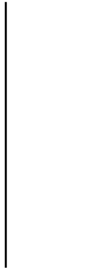
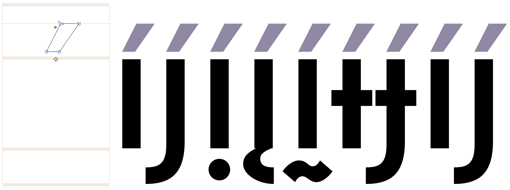
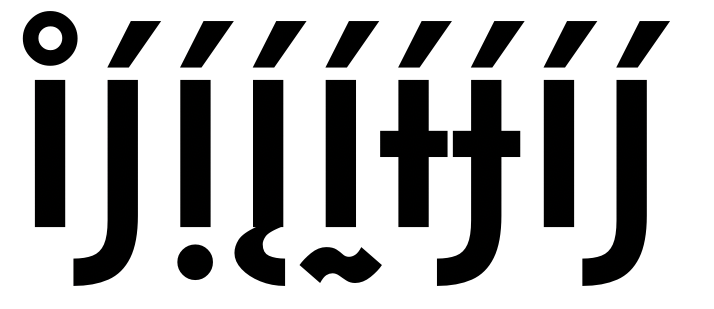

<link href="style.css" rel="stylesheet">

<a href="./index"><button class="button button-i">&larr; GF Guide Index</button></a>

# Diacritic marks
{:.no_toc}

<div class="callout">

A diacritic is a mark used in combination with a base letter for many purposes, such as modifying the pronunciation by extending a basic alphabet to include more phonemes; adding stress that could differentiate similar words, hence meanings; and, in some languages, adding or modifying a vowel in a word.
<br><br>
Many diacritics are separated from the base letter, and can be placed above, below, aside, or through it; while other diacritics connect to the base. 
<br><br>
This guide will give users an overview introduction to diacritics both from a design and technical perspective that will help them avoid the most common problems when shaping texts.

</div>

<div class="context-reading">
    Background reading:<br>
    <mark class="green"><b>must&rarr;</b></mark> <a href="https://googlefonts.github.io/gf-guide/requirements.html#glyphsets)" style="font-weight:bold">Overall font files requirements/Glyphsets</a>
</div>

## Table of contents
{:.no_toc}
* TOC goes here
{:toc}

## Design considerations

- **Diacritics must be coherent and harmonious with the general design of the font.** Take care of details like construction, contrast, thickness, stroke terminal shapes, slope, etc.
- **The marks should also be consistent among themselves.** Related forms like `acute`, `grave` and `circumflex` should share the design decisions as per the above.
- **It is suggested that you design the diacritical marks with the most strict users in mind.** This means respecting conventional contemporary shapes and sizes, and not reusing or interchanging the forms of different diacritics. (For example, a `breve` should not be reused as a `caron`.)
- **Pay attention to the proportion requirements.** There are some marks (for example, the `horn`) which, once combined with the base letter, will blend into the base and resemble an integral part of it.
- **Compound letters must be perceived as a whole.** The distance to the base letter is crucial and can affect legibility. If the mark glyph is too close to the base font, it could appear to collide with the base letter, adding darker spots to the line of text, especially at small sizes. If the mark is too far from the base letter, they would appear separate, making the reading process difficult.
- **The horizontal position is also essential for readability.** In Latin script, the symmetric marks are placed in the optical center of the base letter while the asymmetric ones follow other rules. (Note that the optical center is often distinct from the mathematical center.) But remember, they must be seen as a unity, so they must not be separated or detached from the base letter.
- **In Latin script, it is expected that all marks share the same distance to the base letter.** For particular cases like script fonts where the x-height could vary, marks should at least appear to be at the same optical distance to the base letter.
- **Idiosyncratic or decorative diacritics have given way to more universal or neutral forms.**
- **Ensure creating all the combining marks required for the languages the font are supporting**, as well as the so-called "Legacy Marks". ([See below](#legacy--spacing-marks).) Google Fonts requires at least the GF Latin Core as the minimum set for a font addressing the Latin script. Please read more about our <a href="https://googlefonts.github.io/gf-guide/requirements.html#glyphsets">Glyphsets</a>.
- **Create a set of marks for capital letters** to properly display uppercase letters with diacritics, a separate set of `.case` marks should be created. These marks should be designed with adjustments to size, height, or slope and are typically wider, shorter, and flatter than their lowercase counterparts so they use less vertical space, avoiding collisions with above text lines. These adjustments are particularly relevant for languages like Vietnamese that require stacked diacritics.

**Examples of what to avoid** *- critical cases*
   <figure>
    
    <figcaption style="font-size:0.8em"><i>Multiple diacritics inconsistencies</i></figcaption>
   </figure>
   <figure>
    
    <figcaption style="font-size:0.8em"><i>Size and convention issues</i></figcaption>
   </figure>
   <figure>
    
    <figcaption style="font-size:0.8em"><i>Horizontal position fixes comparison</i></figcaption>
   </figure>

## Legacy – Spacing marks

The spacing diacritical marks (for example, `U+00B4 ACUTE ACCENT`) are required mainly for historical reasons and for backward compatibility. This is why they are also known as "Legacy marks".

These marks are only used as placeholder when typing for a combination of keys to add an accent to a base letter e.g. `´` + `a` to obtain a `á`. 
   <figure>
    
    <figcaption style="font-size:0.8em"><i>Legacy marks in action. Once the sequence of accent + letter is typed it is replaced by the composite glyph in the font, and so gets deleted as a unique glyph.</i></figcaption>
   </figure>

**Requirements:**

- **Legacy marks must have a positive advance width value `≠0`** Due to their function as displaying the accent as a standalone character, they are expected to have an advance width value with positive sidebearings, that is, they should not be zero width glyphs. 
- They should share the design of the `combining marks` ([see below](#combining-diacritical-marks---nonspacing)) for consistency reasons. To ensure this in a practical way, it is suggested to create them by using the combining marks as components in the source file.
- They use the simple name of the mark, e.g. `acute` or `grave`.
- They must have the correct Unicode codepoint in your source file to work properly.
- Although they represent marks, they need to behave as though they are base glyphs; that is, in the GDEF table their "Glyph Class" should be 1. ("Base glyph") In the Glyphs "Font View" under the List mode, they should have `Category=Mark` and `Subcategory=Spacing`.
<br>
<br>
**Latin legacy marks list**

| Name         | Unicode | Catgory | Subcategory
| --------------|---------|---------|-------------
|  acute        | 00B4    | Mark    | Spacing
|  breve        | 02D8    | Mark    | Spacing
|  caron        | 02C7    | Mark    | Spacing
|  cedilla      | 00B8    | Mark    | Spacing
|  circumflex   | 02C6    | Mark    | Spacing
|  dieresis     | 00A8    | Mark    | Spacing
|  dotaccent    | 02D9    | Mark    | Spacing
|  grave        | 0060    | Mark    | Spacing
|  hungarumlaut | 02DD    | Mark    | Spacing
|  macron       | 00AF    | Mark    | Spacing
|  ogonek       | 02DB    | Mark    | Spacing
|  ring         | 02DA    | Mark    | Spacing
|  tilde        | 02DC    | Mark    | Spacing

*Note that any other accent in the font exists only as combining mark*


## Combining diacritical marks - Nonspacing

As the name suggests, the combining diacritics are the marks actually used to construct the accented letters, which would be done either by:

- Creating the [precomposed characters](https://en.wikipedia.org/wiki/Precomposed_character), the accented letters already included in the font source file, e.g. `00C1 Á LATIN CAPITAL LETTER A WITH ACUTE`
- Or to allow the character composition of the accented letters by using the mark + base glyphs on the fly as the user types, e.g. `0041 LATIN CAPITAL LETTER A` followed by the combining diacritical mark `0301 COMBINING ACUTE ACCENT`, which would be the decomposition or [Unicode equivalence](https://en.wikipedia.org/wiki/Unicode_equivalence) of the above. This makes it possible for the combination of diacritics and display of non-encoded accented glyphs.

   <figure>
    
    <figcaption style="font-size:0.8em"><i>Combined marks in action. They can be combined in any way the anchors allow to.</i></figcaption>
   </figure>

**Automatic alignment**

When creating the precomposed characters in the source file, ideally, automatic alignment should be enabled consistently in the composite glyphs. This way they would get automatically updated after any change on any of the components is performed.

*Tip: When using `ufo2glyphs` to convert source files, use this argument to preserve alignments: `--enable-automatic-alignment`*

### Anchors

All the glyphs involved in the generation of accented letters use *Anchors*, which are special points that allow the attachment of glyphs to one another and play a key role in the identification of the glyph definition as well as the generation of the "Mark to base positioning" `mark` and the "Mark to mark positioning" `mkmk` GPOS features ([see below](#the-glyph-positioning-gpos-table)).

Anchors are commonly represented as a red rhombus in the glyph view of the source file and are identified with a name. The name part should be shared among the base glyph and the mark glyph, but in the mark glyph there should be a preceding underscore. For example, there should be a `top` anchor in the base glyph and a corresponding `_top` anchor in the mark.
This name schema is crucial for the positioning to work as expected - for example if the underscore is omitted in the mark glyph, it would not be attached to the base letter - so you must pay special care and attention to them.  

### Requirements for combining marks

- **They must have a zero width value once in the font binary `=0`**. While working on the source file, it is possible to use a positive width with positive sidebearings to facilitate access to the glyph. Then, if the glyphs have the anchors and the correct name, the tool generating the font will take care of changing the width to 0 to comply with the requirement that they must be zero value width glyphs (hence the name **nonspacing**).
- The glyph name of combining marks should use the *comb* suffix, e.g. `acutecomb`, `gravecomb`. 
- The outlines' design should follow the design considerations detailed above.
- They must include anchors named as explained above. To better manage the positions for specific language requirements, such as constructing stacked diacritics in Vietnamese, it maybe useful to use custom names: for example, `top_viet` and `_top_viet`, accordingly.
- The amount of combining marks and precomposed glyphs required will be determined by the language support your font is intended. For Google Fonts see the [Glyphsets](https://googlefonts.github.io/gf-guide/requirements.html#glyphsets) definition.
- They must be assigned the right Unicode codepoint in your source file to work properly. See the [Combining diacritical marks](https://unicode.org/charts/PDF/U0300.pdf) Unicode chart, that ranges from 0300 to 036F codepoints.
- In the GDEF table, their "Glyph Class" should be 3 ("Mark glyph".) In the Glyphs "Glyph info" pane, they should have `Category=Mark` and `Subcategory=Nonspacing`.

Combining marks would be listed like this in the GDEF table:

````code
  <ClassDef glyph="acutecomb" class="3"/>
  <ClassDef glyph="acutecomb.case" class="3"/>
````

### Stacked diacritics

In some languages like Vietnamese, marks are made of the combination of two other marks known as *stacked diacritics*. In such cases, a combining mark could also act as the 'base' glyph of another mark, and therefore, it would need more than one anchor. For example, in the `brevecomb_acutecomb`, the `brevecomb` mark would have one `_top` anchor to be attached to a base letter, plus a `top` one to attach other marks to it; in this case, the `acutecomb`.

- The distance between marks is usually tight and should be consistent with the font. The stacked diacritic should be seen as a unit with the base letter. Smaller shapes than the stand-alone marks can be used to ensure visual balance, especially in capital letters. It is crucial to make sure that these marks are not too high or heavy.
- Again, including the correct anchors with consistent names will ensure the `mkmk` feature in the `GPOS` table.
- Automatic aligment enabled would also be recommended here to avoid placing stacked diacritics manually in the accented glyphs.

### Soft dotted glyphs

Some Latin and Cyrillic glyphs like i or j lose their dot when combined with marks that replace the dot. For example, in Dutch when stress is marked for emphasis `j` can be combined with `acutecomb` in the digraph ij spelled with two acute marks (íj́), in Navajo the `iogonek` can be combined with `acutecomb` (į́), or in Ukrainian when stress is marked `i-cy` can be combined with `acutecomb` (і́).
In such cases, a glyph substitution should make the dot disappear for example by substituting the soft dotted glyphs when combined with at least one top mark by dotless variants with a `ccmp` feature in the `GSUB` table.

<table>
    <tr>
        <td>
            <figure>
                
                <figcaption style="font-size:0.8em"><i>Incorrect behavior of <tt>i-cy</tt> with <tt>acutecomb</tt> (і́), without the appropriate glyph substition.</i></figcaption>
            </figure>
        </td>
        <td>
            <figure>
                 
                 <figcaption style="font-size:0.8em"><i>Expected behavior of <tt>i-cy</tt> with <tt>acutecomb</tt> (і́), with the appropriate glyph substition.</i></figcaption>
            </figure>
        </td>
    </tr>
</table>

A `top` anchor is needed in the dotless variants of the glyphs for correct positioning of the top mark glyphs. A `_top` anchor is needed in the top mark glyphs.

<figure>
 
 <figcaption style="font-size:0.8em"><i>A `top` anchor in the dotless glyphs allow top marks to be .</i></figcaption>
</figure>

In a font with a small Latin set the `ccmp` feature code can have the following lookup:
```code
lookup ccmp_soft_dotted {
    @CombiningTopAccents = [acutecomb brevecomb caroncomb circumflexcomb dieresiscomb dotaccentcomb gravecomb macroncomb ringcomb tildecomb];
    lookupflag UseMarkFilteringSet @CombiningTopAccents;
    sub [i j]' @CombiningTopAccents by [idotless jdotless];
} ccmp_soft_dotted;
```

In Glyphs, the automatically generated `ccmp` feature adds a similar lookup but does not update it with larger glyph sets.

In a font with a larger Latin glyph set and Cyrillic glyph set, after creating the dotless forms of other soft dotted glyphs with glyph construction recipes like `idotless+dotbelowcomb=idotless_dotbelowcomb idotless+ogonekcomb=idotless_ogonekcomb idotless+tildebelowcomb=idotless_tildebelowcomb` or after creating `istroke.dotless` and `jstroke.dotless`, the `ccmp` feature can have a lookup similiar to the following:

```code
lookup ccmp_soft_dotted {
    @CombiningTopAccents = [acutecomb brevecomb caroncomb circumflexcomb dieresiscomb dotaccentcomb gravecomb macroncomb ringcomb tildecomb];
    lookupflag UseMarkFilteringSet @CombiningTopAccents;
    sub [i j idotbelow iogonek itildebelow istroke jstroke i-cy je-cy]' @CombiningTopAccents by [idotless jdotless idotless_dotbelowcomb idotless_ogonekcomb idotless_tildebelowcomb istroke.dotless jstroke.dotless idotless jdotless];
} ccmp_soft_dotted;
```

One should ensure these substitutions do not break when combined with other substitutions, for example the small capitals `smcp` feature should produce small capitals for the soft dotted glyph combined with top marks.

<figure>
 
 <figcaption style="font-size:0.8em"><i>Without the soft dotted substition and the `top` anchor, the sample string i̊j́ị́į́ḭ́ɨ́ɉ́і́ј́ is incorrectly displayed.</i></figcaption>
</figure>
<figure>
 
 <figcaption style="font-size:0.8em"><i>With the soft dotted substitution and the `top` anchor, the sample string i̊j́ị́į́ḭ́ɨ́ɉ́і́ј́ is correctly displayed.</i></figcaption>
</figure>

### Special glyphs

**Vertical caron**

For historical and thus convention reasons, in languages like Czech and Slovak, the caron should have a vertical form when used on characters such as `Lcaron`, `lcaron`, `dcaron`, `tcaron`. But, be aware that it must not be composed with any other "lookalike" form like any quote, comma, and let alone apostrophe. In fact, it should distinguish particularly from the latter to avoid possible meaning confusion for some words. 

- It is more of a simple vertical wedge instead of a curvy comma or apostrophe shape.
- It should not be too wide or large and could have only a subtle inclination.
- It should create as little white space as possible.
- Preferably it should be named `caroncomb.alt` (or caron.alt), and eventually, depending on the design, `caroncomb.alt.case` for `Lcaron`.

Please refer to the ["Useful links"](#useful-links) section below for more information.

**Dotted circle**

The dotted circle character (U+25CC) is inserted by shaping engines before mark glyphs which do not have an associated base, especially in the context of broken syllabic clusters.

For fonts containing combining marks, it is recommended that the dotted circle character is included so that these isolated marks can be displayed properly; for fonts supporting complex scripts, this should be considered mandatory.

Since when a dotted circle glyph is present, it should be able to display all marks correctly, Google Fonts expect all the fonts to include it, regardless of the script it is addressing.

Therefore:
- Dotted circle should be included in all fonts.
- It should have an average glyph width.
- It should include all the anchors used by the base glyphs present in the font so that all marks should be able to attach to it.


## Text Shaping process and Open Type Layout

For a text to be displayed in a readable way on screens or desktop apps, there is a required process called [shaping](https://fonts.google.com/knowledge/glossary/shaping) which consist on translating a string of character codes into an ordered sequence of glyphs, and this process is performed by a engines like [Harfbuzz](https://harfbuzz.github.io/what-is-harfbuzz.html)

For text shaping to work, it depends on four factors: the input string given, the inclusion of [Open Type Layout required tables](https://docs.microsoft.com/en-us/typography/opentype/spec/chapter2) in the font, the writing system (script), and the language of the text. For shaping to occur at all, the `GDEF`, `GSUB` and `GPOS` tables must be present in the font.

### The Glyph Definition (GDEF) table

The `GDEF` table provides various glyph properties used in OpenType Layout processing in six types of information provided in different subtables. One of them is the [*GlyphClassDef*](https://docs.microsoft.com/en-us/typography/opentype/spec/gdef#glyph-class-definition-table) that classifies the different types of glyphs in the font. This subtable will identify each glyph in one of the following classes:

| Class | Description                                                   |
|-------|---------------------------------------------------------------|
| 1     | **Base glyph** (single character, spacing glyph)              |
| 2     | **Ligature glyph** (multiple character, spacing glyph)        | 
| 3     | **Mark glyph** (non-spacing combining glyph)                  |
| 4     | **Component glyph** (part of single character, spacing glyph) | 

Both the `GSUB` and `GPOS` tables rely on this information to identify which glyph classes to adjust with lookups.

For any glyph to be classified into the right class, the following must be ensured on each one:

- The glyph name must be correct. For more context please read the [Glyphs app name tutorial](https://glyphsapp.com/learn/getting-your-glyph-names-right).
- Every `combining mark` must have anchors, as well as the letters intended to become a `base letter`.
- The anchors must have the right name (depending on the the schema explained above).

This identification is critical for the font compilers like Fontmake to process the correct glyph category and export functional fonts. If a glyph is not in the suitable class, you could correct it in the Glyphs font editor by using the “Glyph Info” pane and setting the Category and Subcategory fields described above. In Fontlab editor, you could inspect the "Glyph Panel" in the [OT Class](https://help.fontlab.com/fontlab-vi/Glyph-panel/#ot-class).


### The Glyph Positioning (GPOS) table

GPOS table will use all the glyphs' X and Y position values to precisely control placement operations conditioned by the script and language the font supports, plus advanced typographic composition tasks such as kerning or superscripts.

From the eight type of positioning actions that the table support, at least two are essential for the functioning of diacritic marks:

- **Mark-to-base attachment** Controled by the `mark` feature. *Positions combining marks with respect to base glyphs, as when positioning vowels, diacritical marks, or tone marks in Arabic, Hebrew, and Vietnamese.*
- **Mark-to-mark attachment** Controled by the `mkmk` feature. *Positions one mark relative to another, as when positioning tone marks with respect to vowel diacritical marks in Vietnamese.*

Key factors for these GPOS features to work are:

- Having base and diacritics identified with the proper OT class.
- Anchors on each needed glyph well placed and with the right name.
 
For more context and details, please read the entire [GPOS](https://docs.microsoft.com/en-us/typography/opentype/spec/gpos) entry in the OT Spec.

### The Glyph Substitution (GSUB) Table

Sometimes the correct positioning of a mark will need first to use a different glyph shape for a given base letter, that is, to *substitute* it for another form that will allow the mark to be rightly placed.

A typical case in Latin script is the necessity of using an `i` without the dot to receive any other mark like the `macron`. The `GSUB` table makes it possible for such substitutions through the *Glyph Composition/Decomposition* `ccmp` feature that will substitute for example, the glyph `i` by `idotless` when it is combined with any `comb` accent — this is the soft dotted glyphs case explained above.

Key factors for the [ccmp](https://simoncozens.github.io/feature-tags/#abvf) feature to work are:

- Ensure your font includes all the required substitute glyphs. From the above example the `dotlessi` and `dotlessj` in Latin script. (it should be named `idotless` if you are working on Glyphs font editor.)
- Ensure the `ccmp` feature is included with all the necessary Lookups.
- The `ccmp` feature need to be at the top of features list so that it gets processed prior to any other feature.

For more context and details, please read the entire [GSUB](https://docs.microsoft.com/en-us/typography/opentype/spec/gsub) entry in the OT Spec.


------------------------------------------------------------------------

## Useful links

<div class="useful">
  <div id="col1">
  <b>Design</b>
  <ul>
  <li><a href="https://gaultney.org/jvgtype/typedesign/diacritics/" target="_blank">Problems of diacritic design</a></li>
  <li><a href="https://ilovetypography.com/2009/01/24/on-diacritics/" target="_blank">On diacritics</a></li>
  <li><a href="http://theinsectsproject.eu/" target="_blank">The insects project</a></li>
  <li><a href="http://diacritics.typo.cz/index.php?id=12" target="_blank">Diacritics. All you need to know to design a font with correct accents</a></li>
  <li><a href="https://irenevl.github.io/Polytonic-tutorial/" target="_blank">Polytonic Greek: a guide for type designers</a></li>
  <li><a href="http://www.twardoch.com/download/polishhowto/intro.html" target="_blank">Polish diacritics how to</a></li>
  <li><a href="https://vietnamesetypography.com/tone-marks/" target="_blank">Vietnamese Typography</a></li>
  <li><a href="https://www.setuptype.com/x/cod/" target="_blank">Context of Diacritics</a></li>
  </ul>
  </div>

  <div id="col2">
  <b>Production</b>
  <ul>
  <li><a href="https://glyphsapp.com/learn/mark-to-mark-positioning">Mark to mark positioning Glyphs tutorial</a></li>
  <li><a href="https://help.fontlab.com/fontlab-vi/Anchors-and-Pins/">Anchors in Fontlab</a></li>
  <li><a href="https://harfbuzz.github.io/what-is-harfbuzz.html" target="_blank">Harfbuzz, a text-shaping engine</a></li>
  <li><a href="https://simoncozens.github.io/fonts-and-layout//features-2.html" target="_blank">Substitution and Positioning Rules</a> - advanced reading</li>
  </ul>
  </div>
</div>

<div class="next-reading">
    Further reading:<br>
    <mark class="yellow">learn</mark> <a href="./outlines">Outline Quality</a>
</div>
