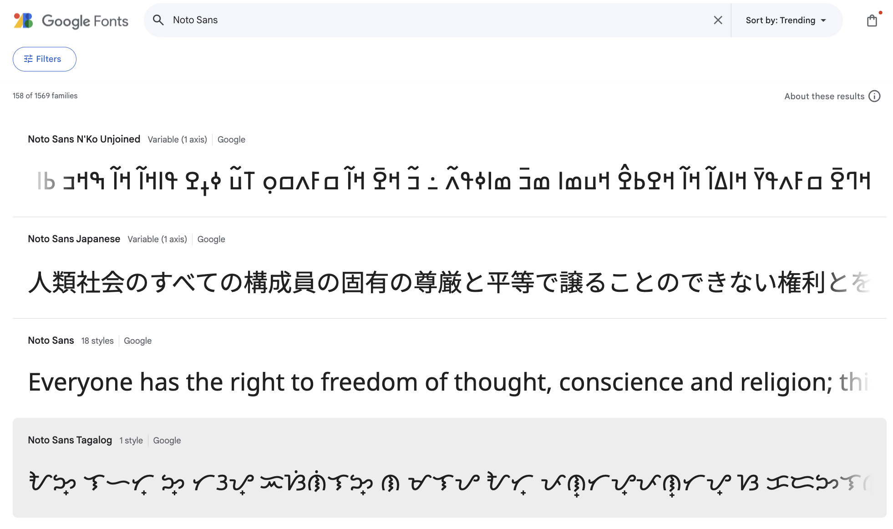
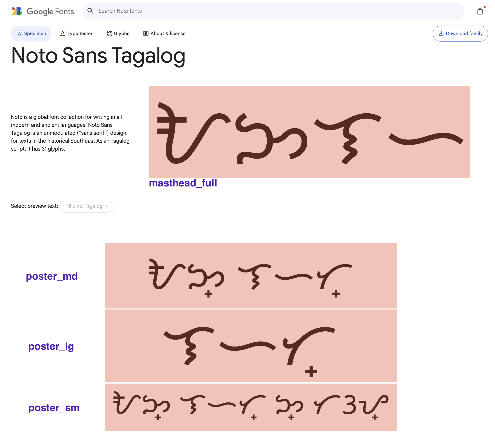
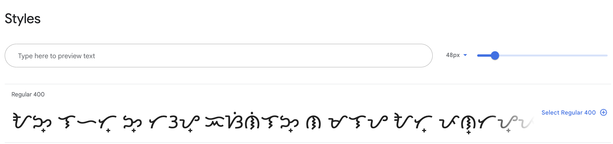
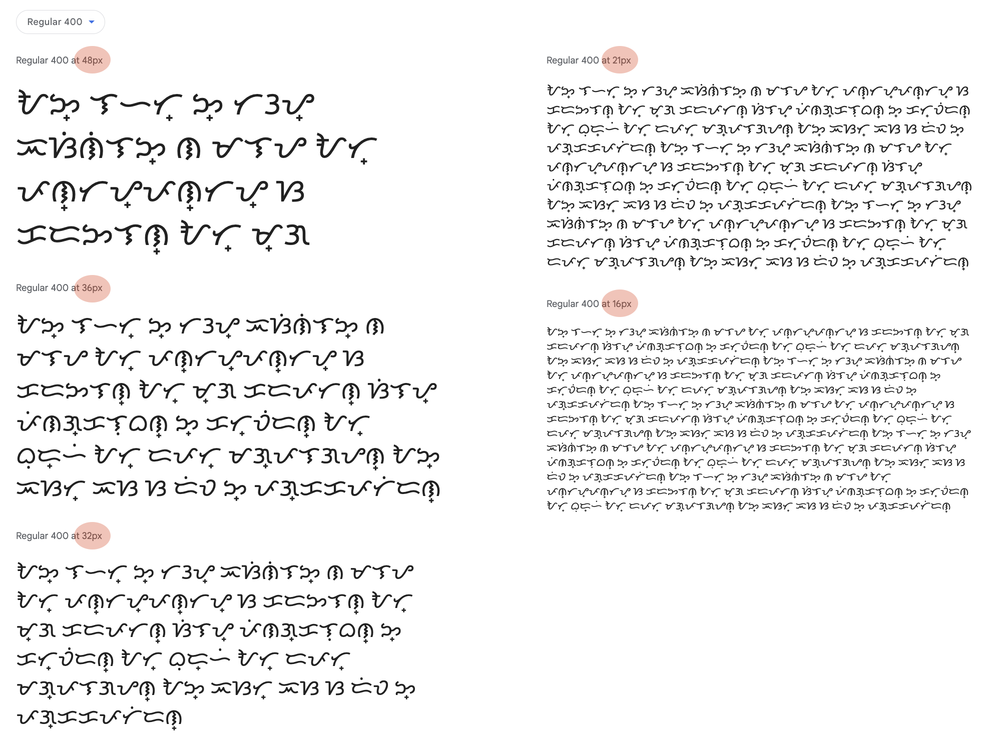
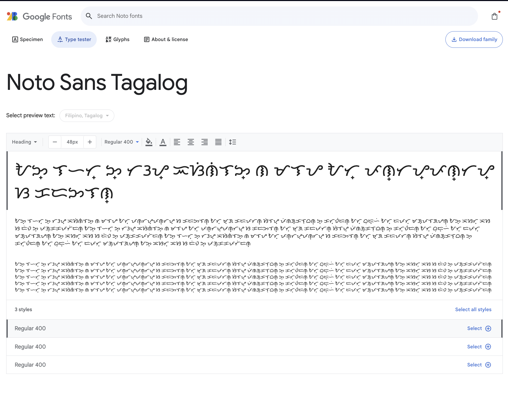
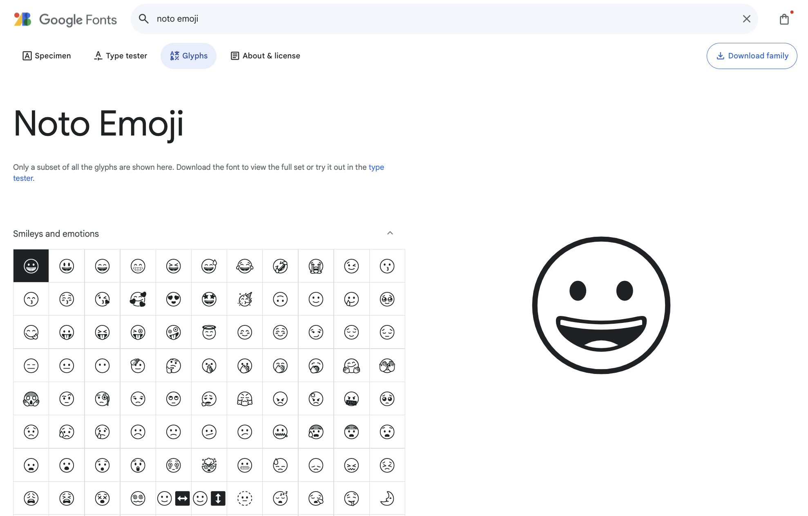

<link href="style.css" rel="stylesheet">

<a href="./index"><button class="button button-i">&larr; GF Guide Index</button></a>

# METADATA file
{:.no_toc}

<div class="callout">

🐸 The <mark class="grey">METADATA.pb</mark> files found in the Google Fonts <mark class="grey">library repo</mark> (<a href="https://github.com/google/fonts">github.com/google/fonts</a>) are <a href="http://en.wikipedia.org/wiki/Protocol_buffers">Protocol Buffers</a> metadata files that contains some information about the font files served by Google Fonts, some of which typically corresponds to font file internal metadata.

</div>

<div class="context-reading">
    Background reading:<br>
    <mark class="purple">nerd&nbsp;</mark> <a href="./googlefonts">google/fonts repository explained</a>
</div>

## Table of contents
{:.no_toc}
* TOC goes here
{:toc}

## History

This documentation was initiated by [Adam Twardoch](https://github.com/twardoch) as a community contributor in 2015, and updated by [Dave Crossland](https://github.com/davelab6) as a member of the Google Fonts team in 2020. It is provided so that other font distributors (webfonts providers or font package maintainers) can better use the library repo repository structure.

This metadata is used specifically by Google Fonts for organization and display on the Google Fonts website. It may be useful for others to be able to make sense of the metadata files.

## Generation

The file can be partially generated by the `gftools add-font` script and [gftools packager](https://github.com/googlefonts/gftools/tree/main/docs/gftools-packager) :

``` code
gftools add-font path/to/google/fonts/ofl/fontdirname
```

The file uses [UTF-8](http://en.wikipedia.org/wiki/UTF-8) encoding.

Below are 2 example `METADATA.pb` files, first for a family of static font files, and then for a family with variable font files, followed by a brief description of each key and possible values.

### Example Static Fonts Family

``` code
name: "Example Sans"
designer: "Firstname Lastname, Person Two, Person Three"
license: "OFL"
category: "SANS_SERIF"
date_added: "2021-09-30"
fonts {
  name: "Example Sans"
  style: "normal"
  weight: 400
  filename: "ExampleSans-Regular.ttf"
  post_script_name: "ExampleSans-Regular"
  full_name: "Example Sans Regular"
  copyright: "Copyright 2021 The Example Sans Project Authors (github.com/username/example-sans)"
}
fonts {
  name: "Example Sans"
  style: "italic"
  weight: 400
  filename: "ExampleSans-Italic.ttf"
  post_script_name: "ExampleSans-Italic"
  full_name: "Example Sans Italic"
  copyright: "Copyright 2021 The Example Sans Project Authors (github.com/username/example-sans)"
}
subsets: "arabic"
subsets: "latin"
subsets: "latin-ext"
subsets: "menu"
subsets: "vietnamese"
primary_script: "Arab"
source {
  repository_url: "https://github.com/username/example-sans"
  commit: "d9098c0a72125d411dbb225a2e5a61dc15265ffc"
}
minisite_url: "https://myfontwebsite.com"
stroke: "SANS_SERIF"
```

### Example Variable Fonts Family

``` code
name: "Example Serif"
designer: "Firstname Lastname, Person Two, Person Three"
license: "OFL"
category: "MONOSPACE"
date_added: "2021-09-30"
fonts {
  name: "Example Serif"
  style: "normal"
  weight: 300
  filename: "ExampleSerif[opsz,wght].ttf"
  post_script_name: "ExampleSerif-Light"
  full_name: "Example Serif Light"
  copyright: "Copyright 2021 The Example Sans Project Authors (github.com/username/example-serif)"
}
fonts {
  name: "Example Serif"
  style: "italic"
  weight: 300
  filename: "ExampleSerif-Italic[opsz,wght].ttf"
  post_script_name: "ExampleSerif-LightItalic"
  full_name: "Example Serif Light Italic"
  copyright: "Copyright 2021 The Example Sans Project Authors (github.com/username/example-serif)"
}
subsets: "latin"
subsets: "latin-ext"
subsets: "menu"
subsets: "vietnamese"
axes {
  tag: "wght"
  min_value: 300.0
  max_value: 700.0
}
axes {
  tag: "opsz"
  min_value: 10
  max_value: 144
}
registry_default_overrides {
  key: "opsz"
  value: 24
}
source {
  repository_url: "https://github.com/username/example-sans"
  commit: "d9098c0a72125d411dbb225a2e5a61dc15265ffc"
}
minisite_url: "https://myfontwebsite.com"
stroke: "SERIF"
classifications: "MONOSPACE"
```

## Description of Keys

Most top-level keys provide unique information which is generally not derived from or matching with data inside the font files themselves. Each top-level field can only occur once in the file. The order of the keys does not strictly matter, but the order in this example is typical and is maintained when possible to avoid noisy diff comparisons.

### name

Family name used to call the family's fonts from the Google Fonts API, and shown in the catalog [fonts.google.com](https://fonts.google.com/).

Example: `name: "ABeeZee"`

### date_added

Date in `YYYY-MM-DD` format that the font was first published by Google Fonts. It is used to order the front page of the [GF catalog](https://fonts.google.com/), both obviously the "date added" sort mode, and also the default "trending mode."

If you set the date added into the future, then the family will stay at the top of the 'trending' sort until that date passes and it trails off like normal.

Once pushed to production, updating it is generally not allowed, although exceptions can be made in limited cases.

Example: `date_added: "2021-09-30"`

### designer

Full name of the type designers or foundries who designed the fonts. Each value typically matches a string in the `designer` key of `info.pb` files in the library repo [/catalog/designers](https://github.com/google/fonts/tree/main/catalog/designers) tree. The order in which the names are listed here will determine the order of appareance in the About section in the font specimen page. (See below.) 

Examples:

-   `designer: "Anja Meiners"` — An individual's name is preferred; typically there is an individual who is the principle designer of the typeface family, even if they are no longer the primary maintainer of the project
-   `designer: "TypeTogether"` — Sometimes a formal organization designs a family and no individual there can be attributed as the principle designer
-   `designer: "Huerta Tipográfica"` — Non-ascii characters are supported as UTF-8
-   `designer: "Principal Designer, Contributor, Contributor"` — In 2016 the catalog UI added a feature to show several named contributors on each font family specimen page, where the value of this key is a comma separated list, and the first item in the list is shown the credit "Principal Design" (Examples: [Rubik](https://fonts.google.com/specimen/Rubik), [Castoro](https://fonts.google.com/specimen/Castoro), [Pacifico](https://fonts.google.com/specimen/Pacifico))

### license

Declares the license of the fonts in the family. Can contain one of 3 possible values:

-   `license: "APACHE2"`
-   `license: "OFL"`
-   `license: "UFL"`

### category

Typographic classifications, one of 5 possible values:

-   `category: "SERIF"`
-   `category: "SANS_SERIF"`
-   `category: "DISPLAY"`
-   `category: "HANDWRITING"`
-   `category: "MONOSPACE"`

In 2023 the `category` field was augmented with two new fields called `stroke` and `classifications`, the category field will continue to exist with no changes to its semantics. We are keeping the `category` field as is because Google products like Workspace and Ads use them and we didn't want to affect those products.

This key is deprecated in the API (cf. below Stroke and Classification), but still mandatory to fill up in METADATA.pb

### fonts

Dictionaries with information specific to each font file in the family. The values in this section typically match those inside the font files. Example:

``` code
fonts {
  name: "ABeeZee"
  style: "normal"
  weight: 400
  filename: "ABeeZee-Regular.ttf"
  post_script_name: "ABeeZee-Regular"
  full_name: "ABeeZee Regular"
  copyright: "Copyright 2011 The ABeeZee Project Authors (github.com/username/abeezee)"
}
```

### fonts — name

Family name used to call the font from the Google Fonts API.
This must match the `name` key used at the top level.
This typically matches the font file's [`name`](https://www.microsoft.com/typography/otspec/name.htm) table ID 16, or if that does not exist, the ID 1.
If multiple ID 16s or 1s exist, they must match.

Example: `name: "ABeeZee"`

### fonts — style

Value of the CSS `font-style` property served by Google Fonts. One of 2 possible values:

-   `style: "normal"`
-   `style: "italic"`

Styles marked as `normal` in the family METADATA file refers to any upright styles, and `italic` refers to any [style-linked](./statics#style-linking) italic styles.

### fonts — weight

Value of the CSS `font-weight` property served by Google Fonts. For families offered as static fonts, this will be one of 9 possible values:

-   `"weight": 100`
-   `"weight": 200`
-   `"weight": 300`
-   `"weight": 400`
-   `"weight": 500`
-   `"weight": 600`
-   `"weight": 700`
-   `"weight": 800`
-   `"weight": 900`

Typically this matches the value of `usWeightClass` in the font file's [`OS/2`](https://www.microsoft.com/typography/otspec/os2.htm) table.

For variable fonts, this will be one of the 9 possible values that corresponds to the `glyf` table outline design.

### fonts — filename

The font filename. Example: `"filename": "ABeeZee-Italic.ttf"`

There is a "canonical" naming scheme for font filenames in the Google Fonts library.

For static fonts the pattern is `$family-$style.ttf` and the allowed values are as follows; These filenames are case sensitive, unlike the default file system of macOS, so `Semibold` is not allowed, and simply renaming it in macOS Finder will not be effective; it needs to be renamed to something with one more/less character, then renamed back to a correct name.

-   `ExampleSans-Thin.ttf`
-   `ExampleSans-ThinItalic.ttf`
-   `ExampleSans-ExtraLight.ttf`
-   `ExampleSans-ExtraLightItalic.ttf`
-   `ExampleSans-Light.ttf`
-   `ExampleSans-LightItalic.ttf`
-   `ExampleSans-Regular.ttf`
-   `ExampleSans-Italic.ttf`
-   `ExampleSans-Medium.ttf`
-   `ExampleSans-MediumItalic.ttf`
-   `ExampleSans-SemiBold.ttf`
-   `ExampleSans-SemiBoldItalic.ttf`
-   `ExampleSans-Bold.ttf`
-   `ExampleSans-BoldItalic.ttf`
-   `ExampleSans-ExtraBold.ttf`
-   `ExampleSans-ExtraBoldItalic.ttf`
-   `ExampleSans-Black.ttf`
-   `ExampleSans-BlackItalic.ttf`

For variable fonts, the naming scheme is the family name, then an alphabetically sorted, comma separated, list of axes within square brackets. If the family has Italic styles in a second file, then the `-Italic` particle is appended to the family name.

-   `ExampleSans[wdth,wght].ttf`
-   `ExampleSans-Italic[wdth,wght].ttf`

### fonts — post_script_name

Value of the font file's [`name`](https://www.microsoft.com/typography/otspec/name.htm) table ID 6. If multiple ID 6s exist, they must match. Example: `post_script_name: "ABeeZee-Italic"`

Typically this matches the stem of the `filename`.

### fonts — full_name

Value of the font file's [`name`](https://www.microsoft.com/typography/otspec/name.htm) table ID 4. If multiple ID 4s exist, they must match. Example: `full_name: "ABeeZee Italic"`

### fonts — copyright

Copyright notice. Example: `copyright: "Copyright 2011 The ABeeZee Project Authors (github.com/username/example-serif)"`

Typically this matches the value of the copyright notice in the first lines of the license file. It also matches the font file [`name`](https://www.microsoft.com/typography/otspec/name.htm) table ID 0. If multiple ID 0s exist, they must match.

### subsets

List of all character subsets available in Google Fonts API for the given font family. They are described as languages, but they are actually script sets.

These subsets are defined in [GF Subsets repo](https://github.com/googlefonts/nam-files/tree/main/Lib/gfsubsets/data) (with the exception of the `menu` subset). 

The `menu` subset is the characters of the font family name (defined above) and is used in font picker UIs to render the font name in itself. 

The subsets must be sorted in alphabetical order. The possible values are the same as the available `nam` files. For example, if a `nam` file is named `chorasmian_unique-glyphs.nam`, the key in `METADATA.pb` would be `subsets: "chorasmian"` (the `nam` file path without "_unique-glyphs.nam")

### primary script

This key aims to indicate which script the specimen page on Google Fonts should display in priority.
The possible values to enter here must refer to the **ID** of the specified script's textprotos from the [lang directory](https://github.com/google/fonts/tree/main/lang/Lib/gflanguages/data/scripts) in `google/fonts` repo.

Example:

```code
primary_script: "Arab"
```

### Languages

This key aims to restrict the number of languages shown in a specimen page. It is mandatory in all Noto fonts but not recommended in non-Nono fonts. It can be useful though when a font support the glyphs of a specific language only.

Example:

```code
languages: "gu_Gujr"  # Gujarati
```

### registry_default_overrides

Override the default value from the Axis Registry. This is required when axis min and max values do not match the registry default, or when the default value differs from the registered default for the axis.

Repeated for each axis.

Contains 2 required child values:

-   `key`, with a string value for the 4 character axis tag code.
-   `value`, as `int` or `float` values.

Example:

``` code
registry_default_overrides {
  key: "opsz"
  value: 18
}
```

→ Look at [Roboto Flex](https://github.com/google/fonts/blob/main/ofl/robotoflex/METADATA.pb) for an example of complex Axis Registry override:

### source

Indicates the upstream repo URL and the commit at which the font was taken, this important for versioning, but also to keep a trace back the origin of the font since multiple forks can exist for one project.

If the source is a *tagged release*, then the source entry should look like this:

``` code
source {
repository_url: "https://github.com/username/projectname"
archive_url: "https://github.com/username/projectname/releases/download/v2.200/projectname-2.200.zip"
}
```

<div class="next-reading">
    Further reading:<br>
    <mark class="grey">templ</mark> <a href="./license">Designer profile</a>
    <br>
    <mark class="grey">templ</mark> <a href="./license">License file</a>
    <br>
    <mark class="grey">templ</mark> <a href="./authors">Authors and Contributors</a>
    <br>
    <mark class="purple">nerd&nbsp;</mark> <a href="./lang">Lang repo</a>
</div>

### Display name

The `display_name` key is used when the font name should appear differently on the API. The main use of this key is for the Noto CJK families which have abbreviated names as a convention. This is not necessarily clear for the user, so the `display_name` key is used to display an unabbreviated name on the specimen page.

Example:
```code
font_name: "Noto Sans JP"
display_name: "Noto Sans Japanese"
```

An other example of use of this key is when the font family name should be written with an hyphen. Indeed, the hyphen is only authorized to separate the family name from the style name; having a font family name with an hyphen would cause a bad file path and postscript name.

Example:

```code
font_name: "Noto Sans PhagsPa"
display_name: "Noto Sans Phags-pa"
```

### Minisite url

This key allows to link a mini website to the font's specimen page. It will appear on top of the page, under the font name, next to the designer's name.

Example:

``` code
minisite_url: "https://myfontwebsite.com"
```


### Classification

The classification field is a repeated field that can be any combination of Handwriting, Display, Monospace, or Symbols, or it can not be set. So for example, if a font is Handwriting, Display and Monospace all at the same time, use all three. If it does not fit into any of those classifications, there is no need to use the field.

-   `classifications: "HANDWRITING"`
-   `classifications: "DISPLAY"`
-   `classifications: "MONOSPACE"`
-   `classifications: "SYMBOLS"`

### Stroke

The stroke field has a single value that is one of `SANS_SERIF`, `SERIF`, `SLAB_SERIF`. It should always be set if one of those options accurately describes the design since some features in the UI only look at the stroke value for some things. Otherwise, if one of the options doesn't describe the design, it can not be set. Google Fonts Search UI will present `stroke` and `classifications` as separate search groups so users can combine them and search, say, for fonts that are Serif and Display.

-   `stroke: "SANS_SERIF"`
-   `stroke: "SERIF"`
-   `stroke: "SLAB_SERIF"`

### Sample text

This key overrides the sample texts provided in the languages texprotos (that you can find in the [Lang](https://github.com/googlefonts/lang/tree/main/Lib/gflanguages/data/languages) repository). Therefore the properties of this keys are the same as the one in a lang textproto.

If sample text is given within a sample text group (e.g. poster, specimen, masthead), all fields within that group must be provided.

- `masthead_full` is a 4 glyphs string (e.g. AaBb) used in a single-script masthead. It is used in specimen masthead component.
- `masthead_partial` is a 2 glyphs string (e.g. Aa) that contributes in building a multi-script masthead. It is used in specimen masthead component.
- `styles` is a phrase that has 40-60 chars. Used in presenting the font in different styles in specimen styles component.
- `tester` is a phrase that has 60-90 chars. It is used in presenting the font in GF catalog specimen type tester component.

Poster samples are used in presenting the font in GF catalog specimen poster component. The poster module has 3 different strings shown in 3 different styles. A `sm`, `md`, and `lg` string is needed for each of the three rows in the poster. The poster group is only used in Noto fonts.

- `poster_sm` is a phrase that has 10-15 chars.
- `poster_md` is a phrase that has 8-12 chars.
- `poster_lg` is a word that has 3-8 chars.

Specimen samples are used as type ramp samples. The <nn> indicates the rendering size.

- `specimen_48` is a sentence that has 60-70 chars.
- `specimen_36` is a paragraph that has 100-120 chars.
- `specimen_32` is a paragraph that has 140-180 chars.
- `specimen_21` is a passage that has 300-500 chars.
- `specimen_16` is a passage that has 550-750 chars.

Example:

```code
sample_text {
  masthead_full: "ᜀᜅᜎᜑ"
  masthead_partial: "ᜆᜂ"
  styles: "ᜀᜅ᜔ ᜎᜑᜆ᜔ ᜅ᜔ ᜆᜂᜌ᜔ ᜁᜐᜒᜈᜒᜎᜅ᜔ ᜈ ᜋᜎᜌ ᜀᜆ᜔ ᜉᜈ᜔ᜆᜌ᜔ᜉᜈ᜔ᜆᜌ᜔ ᜐ ᜃᜇᜅᜎᜈ᜔"
  tester: "ᜀᜅ᜔ ᜎᜑᜆ᜔ ᜅ᜔ ᜆᜂᜌ᜔ ᜁᜐᜒᜈᜒᜎᜅ᜔ ᜈ ᜋᜎᜌ ᜀᜆ᜔ ᜉᜈ᜔ᜆᜌ᜔ᜉᜈ᜔ᜆᜌ᜔ ᜐ ᜃᜇᜅᜎᜈ᜔ ᜀᜆ᜔ ᜋ᜔ᜄ ᜃᜇᜉᜆᜈ᜔ ᜐᜒᜎᜌ᜔"
  poster_sm: "ᜀᜅ᜔ ᜎᜑᜆ᜔ ᜅ᜔ ᜆᜂᜌ᜔"
  poster_md: "ᜀᜅ᜔ ᜎᜑᜆ᜔"
  poster_lg: "ᜎᜑᜆ᜔"
  specimen_48: "ᜀᜅ᜔ ᜎᜑᜆ᜔ ᜅ᜔ ᜆᜂᜌ᜔ ᜁᜐᜒᜈᜒᜎᜅ᜔ ᜈ ᜋᜎᜌ ᜀᜆ᜔ ᜉᜈ᜔ᜆᜌ᜔ᜉᜈ᜔ᜆᜌ᜔ ᜐ ᜃᜇᜅᜎᜈ᜔ ᜀᜆ᜔ ᜋ᜔ᜄ"
  specimen_36: "ᜀᜅ᜔ ᜎᜑᜆ᜔ ᜅ᜔ ᜆᜂᜌ᜔ ᜁᜐᜒᜈᜒᜎᜅ᜔ ᜈ ᜋᜎᜌ ᜀᜆ᜔ ᜉᜈ᜔ᜆᜌ᜔ᜉᜈ᜔ᜆᜌ᜔ ᜐ ᜃᜇᜅᜎᜈ᜔ ᜀᜆ᜔ ᜋ᜔ᜄ ᜃᜇᜉᜆᜈ᜔ ᜐᜒᜎᜌ᜔ ᜉᜒᜈᜄ᜔ᜃᜎᜓᜊᜈ᜔ ᜅ᜔ ᜃᜆ᜔ᜏᜒᜇᜈ᜔ ᜀᜆ᜔ ᜊᜓᜇ᜔ᜑᜒ ᜀᜆ᜔ ᜇᜉᜆ᜔ ᜋᜄ᜔ᜉᜎᜄᜌᜈ᜔ ᜀᜅ᜔ ᜁᜐᜆ᜔ ᜁᜐ ᜐ ᜇᜒᜏ ᜅ᜔ ᜉᜄ᜔ᜃᜃᜉᜆᜒᜇᜈ᜔"
  specimen_32: "ᜀᜅ᜔ ᜎᜑᜆ᜔ ᜅ᜔ ᜆᜂᜌ᜔ ᜁᜐᜒᜈᜒᜎᜅ᜔ ᜈ ᜋᜎᜌ ᜀᜆ᜔ ᜉᜈ᜔ᜆᜌ᜔ᜉᜈ᜔ᜆᜌ᜔ ᜐ ᜃᜇᜅᜎᜈ᜔ ᜀᜆ᜔ ᜋ᜔ᜄ ᜃᜇᜉᜆᜈ᜔ ᜐᜒᜎᜌ᜔ ᜉᜒᜈᜄ᜔ᜃᜎᜓᜊᜈ᜔ ᜅ᜔ ᜃᜆ᜔ᜏᜒᜇᜈ᜔ ᜀᜆ᜔ ᜊᜓᜇ᜔ᜑᜒ ᜀᜆ᜔ ᜇᜉᜆ᜔ ᜋᜄ᜔ᜉᜎᜄᜌᜈ᜔ ᜀᜅ᜔ ᜁᜐᜆ᜔ ᜁᜐ ᜐ ᜇᜒᜏ ᜅ᜔ ᜉᜄ᜔ᜃᜃᜉᜆᜒᜇᜈ᜔"
  specimen_21: "ᜀᜅ᜔ ᜎᜑᜆ᜔ ᜅ᜔ ᜆᜂᜌ᜔ ᜁᜐᜒᜈᜒᜎᜅ᜔ ᜈ ᜋᜎᜌ ᜀᜆ᜔ ᜉᜈ᜔ᜆᜌ᜔ᜉᜈ᜔ᜆᜌ᜔ ᜐ ᜃᜇᜅᜎᜈ᜔ ᜀᜆ᜔ ᜋ᜔ᜄ ᜃᜇᜉᜆᜈ᜔ ᜐᜒᜎᜌ᜔ ᜉᜒᜈᜄ᜔ᜃᜎᜓᜊᜈ᜔ ᜅ᜔ ᜃᜆ᜔ᜏᜒᜇᜈ᜔ ᜀᜆ᜔ ᜊᜓᜇ᜔ᜑᜒ ᜀᜆ᜔ ᜇᜉᜆ᜔ ᜋᜄ᜔ᜉᜎᜄᜌᜈ᜔ ᜀᜅ᜔ ᜁᜐᜆ᜔ ᜁᜐ ᜐ ᜇᜒᜏ ᜅ᜔ ᜉᜄ᜔ᜃᜃᜉᜆᜒᜇᜈ᜔\nᜀᜅ᜔ ᜎᜑᜆ᜔ ᜅ᜔ ᜆᜂᜌ᜔ ᜁᜐᜒᜈᜒᜎᜅ᜔ ᜈ ᜋᜎᜌ ᜀᜆ᜔ ᜉᜈ᜔ᜆᜌ᜔ᜉᜈ᜔ᜆᜌ᜔ ᜐ ᜃᜇᜅᜎᜈ᜔ ᜀᜆ᜔ ᜋ᜔ᜄ ᜃᜇᜉᜆᜈ᜔ ᜐᜒᜎᜌ᜔ ᜉᜒᜈᜄ᜔ᜃᜎᜓᜊᜈ᜔ ᜅ᜔ ᜃᜆ᜔ᜏᜒᜇᜈ᜔ ᜀᜆ᜔ ᜊᜓᜇ᜔ᜑᜒ ᜀᜆ᜔ ᜇᜉᜆ᜔ ᜋᜄ᜔ᜉᜎᜄᜌᜈ᜔ ᜀᜅ᜔ ᜁᜐᜆ᜔ ᜁᜐ ᜐ ᜇᜒᜏ ᜅ᜔ ᜉᜄ᜔ᜃᜃᜉᜆᜒᜇᜈ᜔\nᜀᜅ᜔ ᜎᜑᜆ᜔ ᜅ᜔ ᜆᜂᜌ᜔ ᜁᜐᜒᜈᜒᜎᜅ᜔ ᜈ ᜋᜎᜌ ᜀᜆ᜔ ᜉᜈ᜔ᜆᜌ᜔ᜉᜈ᜔ᜆᜌ᜔ ᜐ ᜃᜇᜅᜎᜈ᜔ ᜀᜆ᜔ ᜋ᜔ᜄ ᜃᜇᜉᜆᜈ᜔ ᜐᜒᜎᜌ᜔ ᜉᜒᜈᜄ᜔ᜃᜎᜓᜊᜈ᜔ ᜅ᜔ ᜃᜆ᜔ᜏᜒᜇᜈ᜔ ᜀᜆ᜔ ᜊᜓᜇ᜔ᜑᜒ ᜀᜆ᜔ ᜇᜉᜆ᜔ ᜋᜄ᜔ᜉᜎᜄᜌᜈ᜔ ᜀᜅ᜔ ᜁᜐᜆ᜔ ᜁᜐ ᜐ ᜇᜒᜏ ᜅ᜔ ᜉᜄ᜔ᜃᜃᜉᜆᜒᜇᜈ᜔"
  specimen_16: "ᜀᜅ᜔ ᜎᜑᜆ᜔ ᜅ᜔ ᜆᜂᜌ᜔ ᜁᜐᜒᜈᜒᜎᜅ᜔ ᜈ ᜋᜎᜌ ᜀᜆ᜔ ᜉᜈ᜔ᜆᜌ᜔ᜉᜈ᜔ᜆᜌ᜔ ᜐ ᜃᜇᜅᜎᜈ᜔ ᜀᜆ᜔ ᜋ᜔ᜄ ᜃᜇᜉᜆᜈ᜔ ᜐᜒᜎᜌ᜔ ᜉᜒᜈᜄ᜔ᜃᜎᜓᜊᜈ᜔ ᜅ᜔ ᜃᜆ᜔ᜏᜒᜇᜈ᜔ ᜀᜆ᜔ ᜊᜓᜇ᜔ᜑᜒ ᜀᜆ᜔ ᜇᜉᜆ᜔ ᜋᜄ᜔ᜉᜎᜄᜌᜈ᜔ ᜀᜅ᜔ ᜁᜐᜆ᜔ ᜁᜐ ᜐ ᜇᜒᜏ ᜅ᜔ ᜉᜄ᜔ᜃᜃᜉᜆᜒᜇᜈ᜔\nᜀᜅ᜔ ᜎᜑᜆ᜔ ᜅ᜔ ᜆᜂᜌ᜔ ᜁᜐᜒᜈᜒᜎᜅ᜔ ᜈ ᜋᜎᜌ ᜀᜆ᜔ ᜉᜈ᜔ᜆᜌ᜔ᜉᜈ᜔ᜆᜌ᜔ ᜐ ᜃᜇᜅᜎᜈ᜔ ᜀᜆ᜔ ᜋ᜔ᜄ ᜃᜇᜉᜆᜈ᜔ ᜐᜒᜎᜌ᜔ ᜉᜒᜈᜄ᜔ᜃᜎᜓᜊᜈ᜔ ᜅ᜔ ᜃᜆ᜔ᜏᜒᜇᜈ᜔ ᜀᜆ᜔ ᜊᜓᜇ᜔ᜑᜒ ᜀᜆ᜔ ᜇᜉᜆ᜔ ᜋᜄ᜔ᜉᜎᜄᜌᜈ᜔ ᜀᜅ᜔ ᜁᜐᜆ᜔ ᜁᜐ ᜐ ᜇᜒᜏ ᜅ᜔ ᜉᜄ᜔ᜃᜃᜉᜆᜒᜇᜈ᜔\nᜀᜅ᜔ ᜎᜑᜆ᜔ ᜅ᜔ ᜆᜂᜌ᜔ ᜁᜐᜒᜈᜒᜎᜅ᜔ ᜈ ᜋᜎᜌ ᜀᜆ᜔ ᜉᜈ᜔ᜆᜌ᜔ᜉᜈ᜔ᜆᜌ᜔ ᜐ ᜃᜇᜅᜎᜈ᜔ ᜀᜆ᜔ ᜋ᜔ᜄ ᜃᜇᜉᜆᜈ᜔ ᜐᜒᜎᜌ᜔ ᜉᜒᜈᜄ᜔ᜃᜎᜓᜊᜈ᜔ ᜅ᜔ ᜃᜆ᜔ᜏᜒᜇᜈ᜔ ᜀᜆ᜔ ᜊᜓᜇ᜔ᜑᜒ ᜀᜆ᜔ ᜇᜉᜆ᜔ ᜋᜄ᜔ᜉᜎᜄᜌᜈ᜔ ᜀᜅ᜔ ᜁᜐᜆ᜔ ᜁᜐ ᜐ ᜇᜒᜏ ᜅ᜔ ᜉᜄ᜔ᜃᜃᜉᜆᜒᜇᜈ᜔\nᜀᜅ᜔ ᜎᜑᜆ᜔ ᜅ᜔ ᜆᜂᜌ᜔ ᜁᜐᜒᜈᜒᜎᜅ᜔ ᜈ ᜋᜎᜌ ᜀᜆ᜔ ᜉᜈ᜔ᜆᜌ᜔ᜉᜈ᜔ᜆᜌ᜔ ᜐ ᜃᜇᜅᜎᜈ᜔ ᜀᜆ᜔ ᜋ᜔ᜄ ᜃᜇᜉᜆᜈ᜔ ᜐᜒᜎᜌ᜔ ᜉᜒᜈᜄ᜔ᜃᜎᜓᜊᜈ᜔ ᜅ᜔ ᜃᜆ᜔ᜏᜒᜇᜈ᜔ ᜀᜆ᜔ ᜊᜓᜇ᜔ᜑᜒ ᜀᜆ᜔ ᜇᜉᜆ᜔ ᜋᜄ᜔ᜉᜎᜄᜌᜈ᜔ ᜀᜅ᜔ ᜁᜐᜆ᜔ ᜁᜐ ᜐ ᜇᜒᜏ ᜅ᜔ ᜉᜄ᜔ᜃᜃᜉᜆᜒᜇᜈ᜔\nᜀᜅ᜔ ᜎᜑᜆ᜔ ᜅ᜔ ᜆᜂᜌ᜔ ᜁᜐᜒᜈᜒᜎᜅ᜔ ᜈ ᜋᜎᜌ ᜀᜆ᜔ ᜉᜈ᜔ᜆᜌ᜔ᜉᜈ᜔ᜆᜌ᜔ ᜐ ᜃᜇᜅᜎᜈ᜔ ᜀᜆ᜔ ᜋ᜔ᜄ ᜃᜇᜉᜆᜈ᜔ ᜐᜒᜎᜌ᜔ ᜉᜒᜈᜄ᜔ᜃᜎᜓᜊᜈ᜔ ᜅ᜔ ᜃᜆ᜔ᜏᜒᜇᜈ᜔ ᜀᜆ᜔ ᜊᜓᜇ᜔ᜑᜒ ᜀᜆ᜔ ᜇᜉᜆ᜔ ᜋᜄ᜔ᜉᜎᜄᜌᜈ᜔ ᜀᜅ᜔ ᜁᜐᜆ᜔ ᜁᜐ ᜐ ᜇᜒᜏ ᜅ᜔ ᜉᜄ᜔ᜃᜃᜉᜆᜒᜇᜈ᜔"
}
```


<figure>

<figcaption aria-hidden="true">Styles in the main view</figcaption>
</figure>

<figure>

<figcaption aria-hidden="true">Masthead and Posters</figcaption>
</figure>

<figure>

<figcaption aria-hidden="true">Styles in the specimen page</figcaption>
</figure>

<figure>

<figcaption aria-hidden="true">Specimen at different sizes</figcaption>
</figure>

<figure>

<figcaption aria-hidden="true">Tester</figcaption>
</figure>

### Ordered sample glyphs

This key overrides the Glyphs page on the UI. Example: [Noto Emoji](https://fonts.google.com/noto/specimen/Noto+Emoji/glyphs). Not recommended to use in other fonts than icon/symbols one.

Example:

```code
ordered_sample_glyphs {
  name: "Smileys and emotions"
  glyphs: "😀 😃 😄 😁 😆 😅 😂 🤣 😭 😉 😗 😙 😚 😘 🥰 😍 🤩 🥳 🙃 🙂 🥲 🥹 😋 😛 😝 😜 🤪 😇 😊 ☺️ 😏 😌 😔 😑 😐 😶 🫡 🤔 🤫 🫢 🤭 🥱 🤗 🫣 😱 🤨 🧐 😒 🙄 😮‍💨 😤 😠 😡 🤬 🥺 😟 😥 😢 ☹️ 🙁 🫤 😕 🤐 😰 😨 😧 😦 😮 😯 😲 😳 🤯 😬 😓 😞 😖 😣 😩 😫 😵 😵‍💫 🙂‍↔️ 🙂‍↕️ 🫥 😴 😪 🤤 🌛 🌜 🌚 🌝 🌞 🫠 😶‍🌫️ 🥴 🥵 🥶 🤢 🤮 🤧 🤒 🤕 😷 🤠 🤑 😎 🤓 🥸 🤥 🤡 👻 💩 👽 🤖 🎃 😈 👿 👹 👺 🔥 💫 ⭐ 🌟 ✨ 💥 💯 💢 💨 💦 🫧 💤 🕳️ 🎉 🎊 🙈 🙉 🙊 😺 😸 😹 😻 😼 😽 🙀 😿 😾 ❤️ 🧡 💛 💚 💙 💜 🤎 🖤 🤍 ♥️ 💘 💝 💖 💗 💓 💞 💕 💌 💟 ❣️ ❤️‍🩹 💔 ❤️‍🔥 💋 🫂 👥 👤 🗣️ 👣 🧠 🫀 🫁 🩸 🦠 🦷 🦴 ☠️ 💀 👀 👁️ 👄 🫦 👅 👃 👂 🦻 🦶 🦵 🦿 🦾 💪 👍 👎 👏 🫶 🙌 👐 🤲 🤝 🤜 🤛 ✊ 👊 🫳 🫴 🫱 🫲 🤚 👋 🖐️ ✋ 🖖 🤟 🤘 ✌️ 🤞 🫰 🤙 🤌 🤏 👌 🖕 ☝️ 👆 👇 👉 👈 🫵 ✍️ 🤳 🙏 💅"
}
```

<figure>

<figcaption aria-hidden="true">Glyphs category in the Glyphs page</figcaption>
</figure>
