<link href="style.css" rel="stylesheet">

<a href="./index"><button class="button button-i">&larr; GF Guide Index</button></a>

# Onboarder workflow guide
{:.no_toc}

<div class="callout">

🐝 Google Fonts has become too big to be maintained as a simple community repository. The platform is now an API distributing and serving more than a thousand font families, and GF has started to see itself as a proper open-source foundry.

This means several things:

<ol>
    <li> While in the past spontaneous contributions were still possible, today, the specifics of the requirements and the security in place have made it complicated for a random user to make such a contribution. If a user makes a PR, it will definitely draw some attention, but the PR often needs to be redone by a team member. So, while contribution to the repo is not, in theory, exclusive to the “onboarders” (contracted team members), it tends to be in practice.</li>
    <li> Google Fonts has commissioned hundreds of fonts from professional type designers. To onboard these projects (from the moment the font family is considered “ready”), we need a toolchain that automates most of the repetitive tasks such as packaging the fonts (<mark class=grey>gftools packager</mark>) and generating QA proofs (<mark class=grey>gftools qa</mark>).</li>
    <li>The workflow must leave no place to doubt about the status of the project. Indeed, once merged into the <mark class=grey>google/fonts</mark> repo, the font still travels through different servers before appearing on the API. It has often happened that fonts never got into production — because they have been forgotten in the sandbox server or elsewhere.</li>
</ol>

The workflow described below was designed to ensure no lost products during the validation process, to facilitate the latter, and to keep people updated about the status of different projects. It requires active maintenance and regular updates from team members.
<br>
It also seemed important to keep the whole status of the repository in one place, mostly to avoid copy-pasting PR links all the time. Therefore, a complete GitHub-based workflow was chosen, making extensive use of the <a href="https://github.com/google/fonts/issues">issue tracker</a>, the <a href="https://github.com/google/fonts/milestones">milestones</a> feature, the <a href="https://github.com/google/fonts/projects">project boards</a>, and the <a href="https://github.com/google/fonts/actions">continuous integration system</a>.
<br>
This guide will help team members understand the validation process of a font family and the actions required from them to help that process.
<br>
→ <a href="https://google.github.io/fonts/">google.github.io/fonts</a> is a page updated weekly that reports on activity in the <a href="https://github.com/google/fonts">google/fonts</a> repo.

</div>

<div class="context-reading">
    Background reading:<br>
    <mark class="purple">nerd&nbsp;</mark> <a href="./googlefonts">google/fonts repository explained</a>
    <br>
    <mark class="purple">nerd&nbsp;</mark> <a href="./making-pr">Making a PR to Google Fonts</a>
</div>

## Table of contents
{:.no_toc}
* TOC goes here
{:toc}

## The onboarding process

To preserve the synchronization of source files, the [google/fonts repository](https://github.com/google/fonts) doesn't host font *sources* —only font *binaries*.

<br>
<figure>
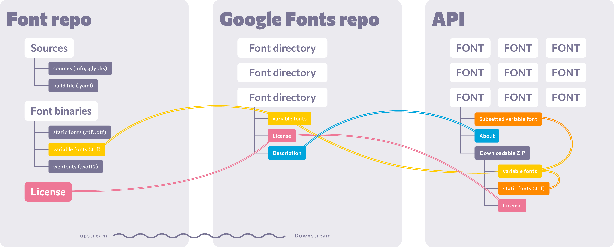
<figcaption aria-hidden="true">Upstream to Downstream.</figcaption>
</figure>
<br>

"Upstream" is the further we can go to the original files; since [google/fonts](https://github.com/google/fonts) is only hosting a copy of the font files —pulled from that original designer's repository— we can say that google/fonts is somewhere *down* the stream. The API processes that file and serves a subsetted version, but the original font file can be found in the downloadable zip file from the platform. 

None of these three instances are directly linked, though. At least three persons, at each instance, will interact with that font file before it is available on [fonts.google.com](https://fonts.google.com). Let's go briefly through the process step by step:

1. After a font has been commissioned or submitted to Google Fonts through the google/fonts issue tracker. An onboarder will be assigned to that project.
2. The fonts will be reviewed, corrected, and built in the upstream repository. They will then be packaged and sent through a [Pull Request (PR) to the google/fonts repository](./package.md).
3. From there, another onboarder should [QA the font](./qa.md) and the overall package before merging it into the google/fonts repository.
4. An on-call engineer must push the font file to the API. 

The font doesn't go directly to the live API; it has to travel through intermediate servers, where it will be reviewed and validated again to ensure the API is showing the font correctly.

<br>
<figure>
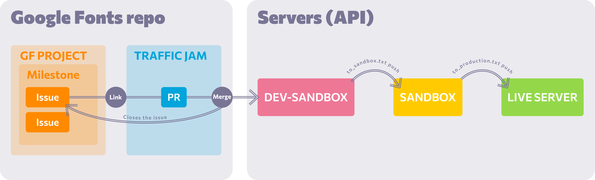
<figcaption aria-hidden="true">From the issue to fonts.google.com</figcaption>
</figure>
<br>

This graphic shows how a project travels from the google/fonts GitHub repository to [fonts.google.com](https://fonts.google.com).

- The [google/fonts repository](https://github.com/google/fonts) is linked to the `dev-sandbox` server. Each merged PR will appear a few or more minutes later on the `dev-sandbox` (if it works correctly).
- Once a PR is merged, the linked issue gets automatically closed, but it doesn't mean the issue is completed because the fonts still need to be live.
- Once the fonts are in the `dev-sandbox`, we can add them to the [to_sandbox.txt list](https://github.com/google/fonts/blob/main/to_sandbox.txt). The API engineers then push the list of families in `sandbox`. 
- From there an onboarder can check if the fonts look alright in `sandbox`, and if that is the case, they can add them to the [to_production.txt list](https://github.com/google/fonts/blob/main/to_production.txt). The API engineers can then push the families onto the [fonts.google.com](https://fonts.google.com), available to the public.

This process takes 2 to 4 weeks, because the push to sandbox or production only happens once every alternating week — if not less frequently.

You see the importance of the issues and the pull requests (PR) in the graphic. We try to keep connected the issue and the PR that fixes it, but we do track them on different boards. The **Google Fonts board tracks the issues** (that are our link to the upstream repos), and the **Traffic Jam board tracks the PRs** (that are our link to the servers and the API).

Finally, it is important to note that while the **API is the primary space for the users**, the **google/fonts repo is the primary space of the onboarders**, and the **upstream font repo is the primary space of the author**. Since it is impossible to satisfy everyone in all spaces, these priorities are to be taken seriously into consideration when facing a problem: 
- All fonts sent to the users should be tailored for the best user experience.
- Google Fonts shouldn't force anything onto the designer's repository. A consensual collaboration is key. In case of disagreement, Google Fonts would need permission to migrate the upstream repo into the `googlefonts` org.
- The google/fonts issue tracker can harvest users' feedback and reports, but this repository is primarily the workspace of an entire team. A cordial and respectful communication is necessary, but the user is not king there: the mental health of the team members is.

## The Google Fonts project board

The project board is a way to sort all the font project issues that are contained in it. There is usually no pull request in this project board (they are tracked in the Traffic Jam board). Each tab has specific filters to be able to focus on one aspect of the issue.

## The milestones

Each issue that we intend to care for should be added to the Google Fonts project board, but also to a milestone. This allows us to divide and anticipate the workload in time.

<br>
<figure>
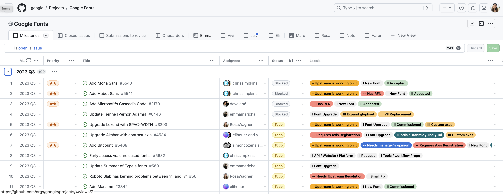
<figcaption aria-hidden="true">Milestones</figcaption>
</figure>
<br>

To preserve a clean workflow, the Milestone needs to be assessed at the end of the quarter so we can move the still-open issues to the next Milestone to be able to close this one. 

To have a proper overview of the milestones, the `Milestones` tab in the GF board allows to see all *open* issues (triaged by quarter). We can see all the necessary information linked to an issue: the onboarder assigned, the priority level, the progress status, and the labels.

<br>
<figure>
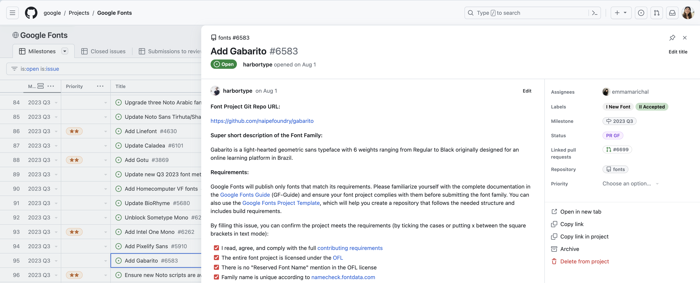
<figcaption aria-hidden="true">Issue viewed from the GF Board</figcaption>
</figure>
<br>

## The open issues

[Issues](https://github.com/google/fonts/issues) in the `google/fonts` repository are used to define the Google Fonts production pipeline for team members, collaborating designers, and for users to report bugs or suggest new submission ideas.

For the project manager and the onboarder, the bridge between what happens upstream and what is reported downstream is made through the issues. In order to track the project appropriately, the issue must contain a certain number of information, and for that, we use the GitHub API extensively.

<br>
<figure>
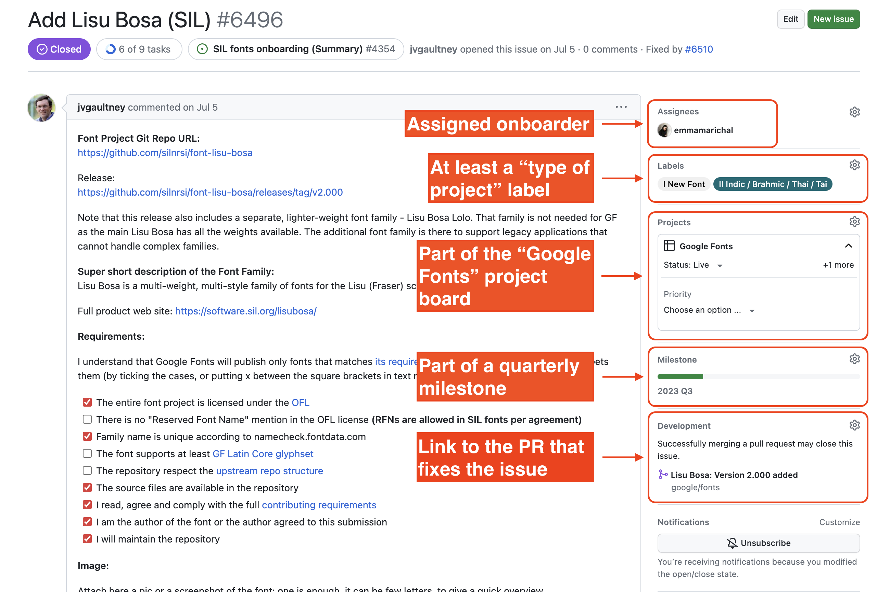
<figcaption aria-hidden="true">Issue viewed from the google/fonts issue tracker.</figcaption>
</figure>
<br>

###  One issue per font project

What do we mean by font project? "Adding a new family", and "upgrading a family" are font projects. We consider the project *completed* once that version of the font hits *production*. Upgrading a font after its release on [fonts.google.com](https://github.com/google/fonts) would be considered as a new project and therefore a new issue for it is required.

Issues can be used to communicate with the designer and should be updated regularly with a comment about the progress status. It is recommended to use the [template issues](https://github.com/google/fonts/issues/new/choose) in order to have all the information we need to start a project. 

We want one issue per font project because we allow a PR to change one font directory *only*. Therefore, the issue can be closed by the PR that makes these changes. As we say above, it doesn't mean that the project is completed, though. It happens that we see a problem in sandbox; in this case, we re-open the issue to fix it with another PR. Therefore several PRs can be linked to the same issue.

<br>
<figure>
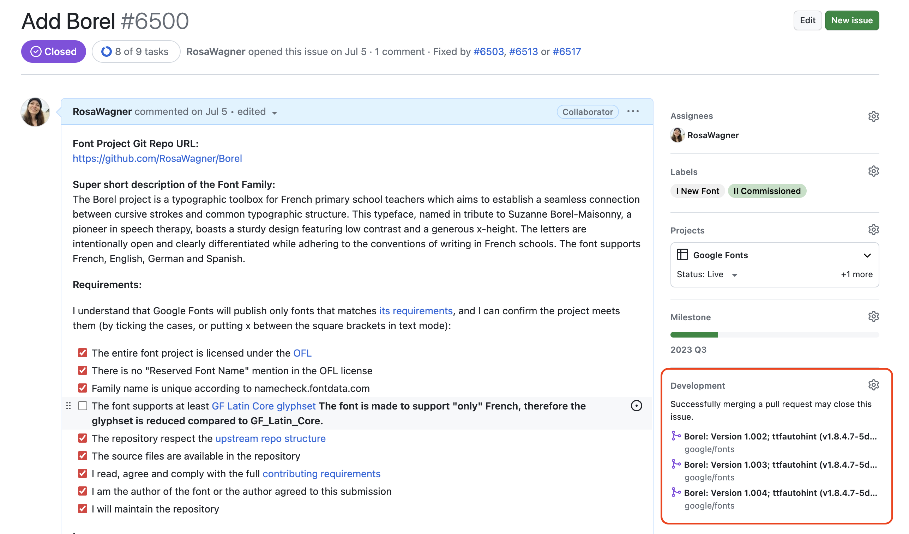
<figcaption aria-hidden="true">An example of project that needed several edits after merging.</figcaption>
</figure>
<br>

###  Labels

1. All issues should be labeled at least with a *primary category label* (start with `I`). These labels are **grey** and inform about the **type of project**, typically: <mark class=grey>I New font</mark>, <mark class=grey>I Font upgrade</mark>, <mark class=grey>I Font bug</mark>.

2. The *secondary category labels* (start with `II`) are **green** and allow to add **mandatory additional information**. 

    Every <mark class=grey>new fonts</mark> issues should be labeled with a light-green label: 

    - <mark class=green>II Commissioned</mark>: any project Google financed partly or fully.
    - <mark class=green>II Submitted</mark> or <mark class=green>II Accepted</mark>. Commissioned projects have priority over accepted submitted projects.

    When the primary language supported is a complex script (usually not Latin-Cyrillic-Greek), a dark-green label must inform us about it. Indeed, the world languages need special care for the API to display the script appropriately, they also need onboarders with expertise to take care of them. We divided them into script categories: 

    - <mark class=darkgreen>II African</mark>
    - <mark class=darkgreen>II Arabic / Hebrew / Semitic / RTL</mark>
    - <mark class=darkgreen>II CJK</mark>
    - <mark class=darkgreen>II Indic / Brahmic / Thai / Tai</mark>

    We also use dark-green labels to precise certain conditions/technologies that require special attention such as:

    - <mark class=darkgreen>II Color font</mark>
    - <mark class=darkgreen>II Custom axes</mark>
    - <mark class=darkgreen>II Icon / symbols / not text</mark>

3. The *tertiary category labels* (start with `III`) are **orange** and allow to know more about the **type of upgrade**. Every <mark class=grey>Font upgrade</mark> issue should have an orange label:

    - <mark class=orange>III Expand glyphset</mark>
    - <mark class=orange>III Expand styles</mark>
    - <mark class=orange>III Improve rendering / layout</mark>
    - <mark class=orange>III VF Replacement</mark>  

4. When in doubt, **call on someone else** with these **blue** labels:
    - <mark class=blue>-- Needs manager's opinion</mark>: This is to apply when Chris and/or Dave are the only ones to make a decision about the issue. It is better to list these in the "Pipeline meeting" doc to be sure they don't remain unnoticed.
    - <mark class=blue>-- Needs Eng team opinion</mark>: typically issues/bug related to the API. Better to list these in the "technical pipeline meeting" doc to be sure they don't remain unnoticed.
    - <mark class=blue>-- Needs expertise</mark>: for example, if the primary script is a complex script, applying this label allows us to know that an expert in this script should be assigned to review this issue.


### Progress status

The progress status exists through the Project Board. Like the Priorities, they are not labels but a proper custom field displayed as a column in the project boards. It is possible to add more custom fields (and also modify them) in one project board's settings.

<br>
<figure>
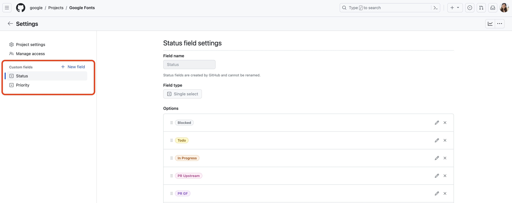
<figcaption aria-hidden="true">Three dot menu > settings > Custom fields</figcaption>
</figure>
<br>

- <mark class=yellow>To do</mark>: default status when an issue is raised.

**Manual status:**
- <mark class=orange>In progress</mark>: the onboarder has started to work upstream on the project.
- <mark class=grey>Blocked</mark>: something is blocking the onboarding process.
- <mark class=grey>Won't happen</mark>: after discussion, it has been decided to not proceed with the onboarding.

**Automatic status:**
- <mark class=purple>PR GF</mark>: the font is packaged in a PR to google/fonts repo.
- <mark class=pink>In Dev</mark>: the PR has been merged, and the font is in the dev-sandbox.
- <mark class=yellow>In Sandbox</mark>: the font is now in Sandbox.
- <mark class=green>Live</mark>: the font is in production.

The progress status from <mark class=orange>In progress</mark> to <mark class=purple>PR GF</mark> is set manually by the onboarder managing that project. The ones from <mark class=pink>In Dev</mark> to <mark class=green>Live</mark> should be automated thanks to `gftools push module` (see below for more information). 

This is how to set the progress status manually:

<br>
<figure>
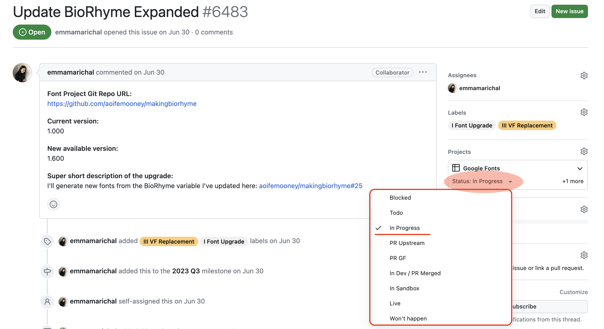
<figcaption aria-hidden="true">How to set the progress status in an issue.</figcaption>
</figure>

<br>

<figure>
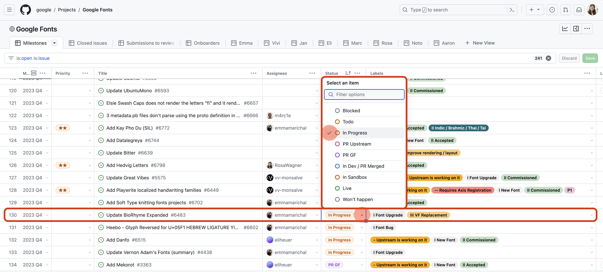
<figcaption aria-hidden="true">How to set a status from the Milestone tab.</figcaption>
</figure>

<br>
<figure>
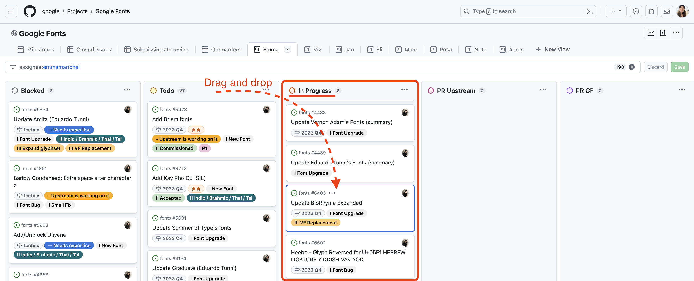
<figcaption aria-hidden="true">How to set the progress status from the Onboarder's tab.</figcaption>
</figure>
<br>

###  Mandatory content

- **The original designer should be tagged when possible.** 

    The issue becomes then the place for the designer to update us about their progress and notify onboarders that the font is ready for review. If they have a problem, they can also report it there and link to a specific issue; this way we have a good track of the different events that block us from onboarding a font.

- **The upstream repo must be linked to the issue.**

    Sometimes, multiple sources of a font can exist on GitHub, or a source may be difficult to find. To make life easier for onboarders, a link to the source repo must be included. We try to ensure that the upstream is the original source of the font (typically, the repo was made by the font's designer), and not using some fork as a source. When an author is unresponsive after giving consent to collaborate with Google Font, we may need to fork the project in the [googlefonts repository](https://github.com/googlefonts) so we can maintain it ourselves.

## The closed issues

<br>
<figure>
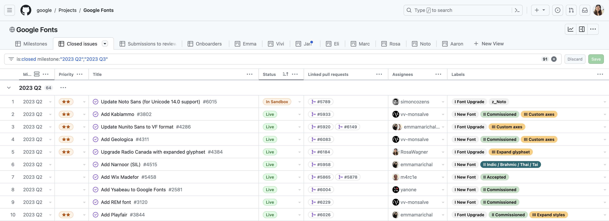
<figcaption aria-hidden="true">Closed Issues</figcaption>
</figure>
<br>

The `Closed issues` tab allows to follow the status of each project once they have been merged and send to the `dev-sandbox`. Their status are: <mark class=pink>In Dev</mark>, <mark class=yellow>In Sandbox</mark> or <mark class=green>Live</mark>. If an issue occurs *before* it gets live, then the issue should be re-open and amended with a new PR.


## Submissions to review

<br>
<figure>
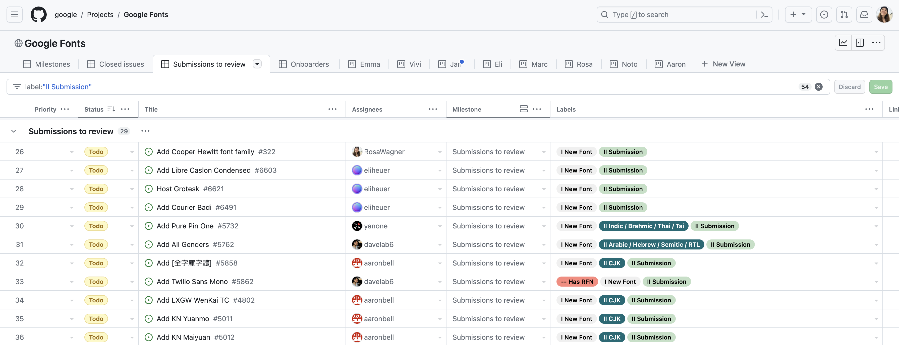
<figcaption aria-hidden="true">Submissions to review</figcaption>
</figure>
<br>

The `Submissions to review` tab is filtered by the <mark class=green>submission</mark> label. The submission issues are typically divided into two milestones: the "submission to review" and the "icebox" milestones.

When an issue is placed in the "icebox" milestone, it is the responsibility of the manager to close this issue "as not planned" or keep it open indefinitely. 

### Answering an issue

Maintaining the repository means answering issues opened by users. Most of them are submissions to review or font bugs. Anything related to the API that seems important should be transferred to the on-call team through the dedicated group chat.

This is how we proceed once a new font is proposed through the issue tracker:

#### If the submission is not worth reviewing

- Sometimes commercial fonts are submitted, or some user are spamming the repo: in this case we simply close the issue "as not planned" with a small cordial comment explaining why we consider this as spam. 

- Sometimes the font is clearly not professional and needs several month of practice and work by the designer: in that case we close the issue "as not planned" with a small paragraph with suggestion on how to improve the quality of the font —in addition of links to tutorial or some relevant chapters of the GF guide.

<br>
<figure>
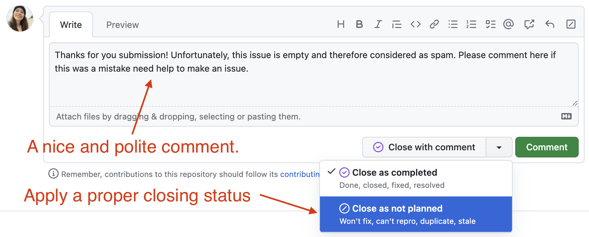
<figcaption aria-hidden="true">How to answer a spam</figcaption>
</figure>
<br>

#### If the font is worth reviewing but some elements are missing 

If elements such as sources, description in the `README.md` file, etc. are missing, we simply ask the designer to provide those elements so we can review the font properly. 

#### If the font is worth reviewing and not missing element

An onboarder should be assigned to give a review. That review is then submitted at the "Pipeline meeting" to a collective vote. The final answer should be given in comment of the submission issue.

- **If the font is rejected**: we close it "as not planned" with an explanation, or we move it the "icebox" milestone for later. In case of rejection we must change the status of the issue from <mark class=yellow>to do</mark> as <mark class=grey>won't happen</mark> or <mark class=grey>blocked</mark>.

- **If the font is accepted**: we assign an onboarder, a milestone, change the <mark class=green>Submission label</mark> to the <mark class=green>Accepted</mark> label. We also notify the designer in comment of the issue with a proposed timeline such as: *"depending on the pipeline, we may be able to onboard this font next quarter, please make sure you receive notifications etc."*.

#### Labels for submissions or commissioned projects

Some labels have been created to quickly see **what's blocking** the issue, they are **red** and starts with `--`: 

- <mark class=red>-- Bad rendering</mark>: we use it for everything related to hinting, bad outline quality, spacing/kerning 
- <mark class=red>-- Glyphset issue</mark>: typically, some glyphs are missing, see [font's requirements chapter](./requirements#glyph-sets)
- <mark class=red>-- Has RFN</mark>: see [License chapter](./license-file.md)
- <mark class=red>-- Missing sources</mark>
- <mark class=red>-- Needs design work</mark>
- <mark class=red>-- Needs upstream resolution</mark>: if the repository is wrong or missing, see [Upstream repo chapter](./upstream.md)
- <mark class=red>-- Needs Meta/Desc/License changes</mark>: typically if the License is wrong or if the upstream's README doesn't mention something important like a fork, see [README file chapter](./readmefile.md)
- <mark class=red>-- fontforge/fontlab/fontcreator</mark>: this is not a deal breaker, so the color is rather pink. But it is important to specify it because it might influence the time dedicated to onboard this project. 
- <mark class=orange>-- Upstream is working on it</mark>: it is actually orange and means that the authors has not delivered the files, that the project is still in progress on their side. A lot of issues are stalled because of that.

#### When to close an issue

Keeping issues unnecessarily opened have several impacts:
- it clogged the issue tracker
- it drowns the important issues
- it decreases the value and the worth given to an open issue
- it discourages fixing issues
- it creates confusion between issues actively worked on and abandoned ones
- it discourages the users to open necessary issues
- it adds to the mental charge of the repo maintainer

We can therefore consider that leaving issues unnecessarily opened is a proper mistreatment of the users, the team members and the pipeline.

So when to close an issue?

- If an issue gets labeled <mark class=grey>won't happen</mark>, it is more likely that it is for the best to close it to relieve the issue tracker from open issues. It can also be removed from the GF Project Board. 

- If the issue is labeled <mark class=grey>blocked</mark>, it must be decided if an effort will be made to unblock it or not. If not, closing this issue is also for the best.


## Onboarders' tabs

The `Onboarders` tabs are the special project management spaces for each onboarder individually. They can see what is assigned to them, and update the status of each issue by dragging and dropping the issue from a column to another. They are also asked to update regularly the status of project in comment of the related issue.

<br>
<figure>
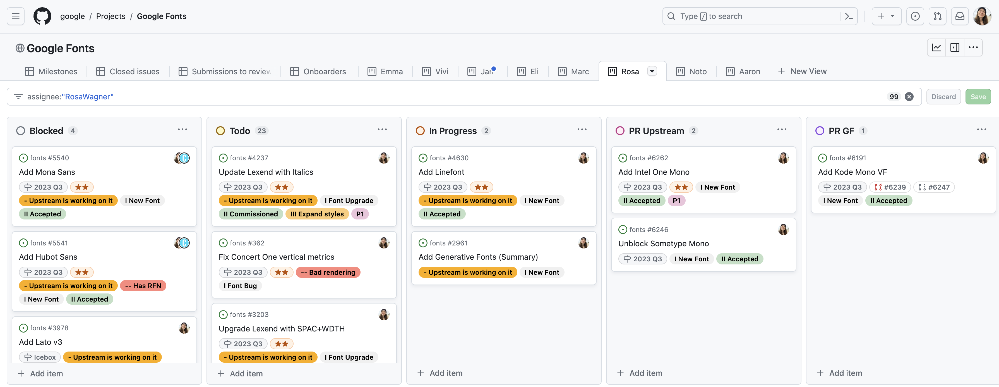
<figcaption aria-hidden="true">Individual onboarder tab</figcaption>
</figure>
<br>

## The Traffic Jam project board

The traffic Jam project board is the space where we track, sort and filter the Pull Requests. We use it to check in which server and in which push list a certain version of the family stands.

The first tab would group the PRs by `Servers` and sort them by `Lists`. It is particularly useful at the moment of preparing/generating the push lists. You can see everything that is in the dev-sandbox and decide to block and add to a list.

<br>
<figure>

<figcaption aria-hidden="true">Traffic Jam's first tab; folded; grouped by Servers</figcaption>
</figure>

<br>

<figure>
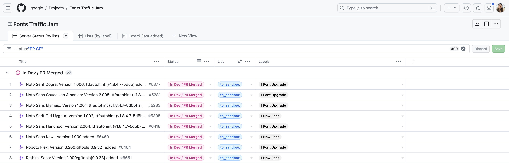
<figcaption aria-hidden="true">Traffic Jam's first tab; unfolded; sorted by lists</figcaption>
</figure>
<br>

The second tab would group the PRs by `Lists` and sort them by `Labels`. It is particularly useful at the moment of checking the fonts in the servers. You can see everything that belonged to a list by type of project and decide to block or to upgrade list.

<br>
<figure>
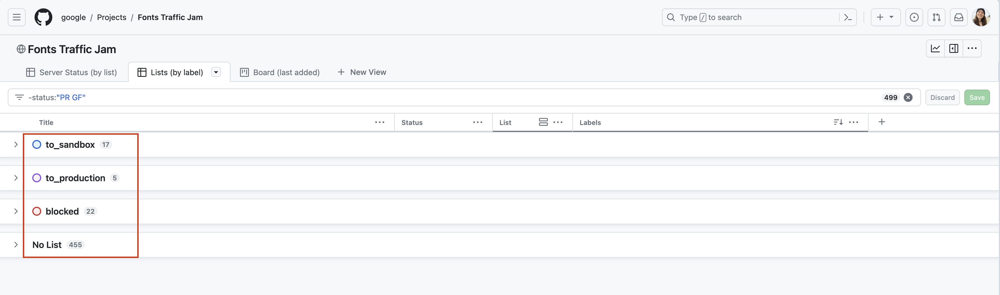
<figcaption aria-hidden="true">Traffic Jam's second tab; folded; grouped by lists</figcaption>
</figure>

<br>

<figure>

<figcaption aria-hidden="true">Traffic Jam's second tab; unfolded; sorted by labels</figcaption>
</figure>
<br>

The `status` column is updated thanks to the `gftools push module`. It checks the servers against the font families and output which server displays which version. The `lists` column on the other hand is updated manually.

1. <mark class=pink>In Dev</mark> / `no list tag`: these PRs were merged recently and not added to a list yet. You can add them the tag <mark class=blue>to_sandbox</mark> at the moment of preparing the lists, or <mark class=red>blocked</mark> if something is wrong after merging.
2. <mark class=pink>In Dev</mark> / <mark class=blue>to_sandbox</mark>: the font has not yet been pushed to Sandbox.
3. <mark class=yellow>In Sandbox</mark> / <mark class=blue>to_sandbox</mark>: the font directory path has been effectively pushed to Sandbox. 
    - Check each item in Sandbox (see later section to know how to check them). 
    - If they pass, they can be added into the <mark class=purple>to_production</mark> list. 
    - You can also check the item on the list that have not been pushed and investigate why.
    - If a PR had the label <mark class=grey>small fix</mark> it can mean that it is amending a blocked PR in Sandbox. We only need to track one PR per server, if two PRs for the same project are in the same server you can remove one from the project board (usually the one that amends the original one, or the one that contains the less files).
    - Check and update status and list of items that are not covered by the script (knowledge, language, etc)
4. <mark class=yellow>In Sandbox</mark> / <mark class=purple>to_production</mark>, it has not been pushed to prod yet.
5. <mark class=green>Live</mark> / <mark class=purple>to_production</mark>: it has been effectively pushed to prod. You can remove the list tag if nothing curious or abnormal occurs (such as something you know can't be live).
6. `whatever` / <mark class=red>blocked</mark>: something is wrong and the PR should be amended to be able to get on a list. A comment should be written in the PR or the linked issue, and the issue re-open. The list of blocked project should be assessed regularly with a will of unblocking them.

### The Pull Request

Every new PRs will be automatically added to the Traffic Jam board, except for the ones with the label <mark class=grey>Tool/Workflow/Repo</mark>. 

- The PRs don't need to be put into a milestone because the issues are already tracked in the milestones (it would be duplicated data).
- If the PR is still in progress and a review is not needed yet, it should be turned into a draft PR. But it is recommended to package the font only when the font files are ready and passed all the quality assurance tests. This stage is supposed to only be a second opinion.

<br>
<figure>
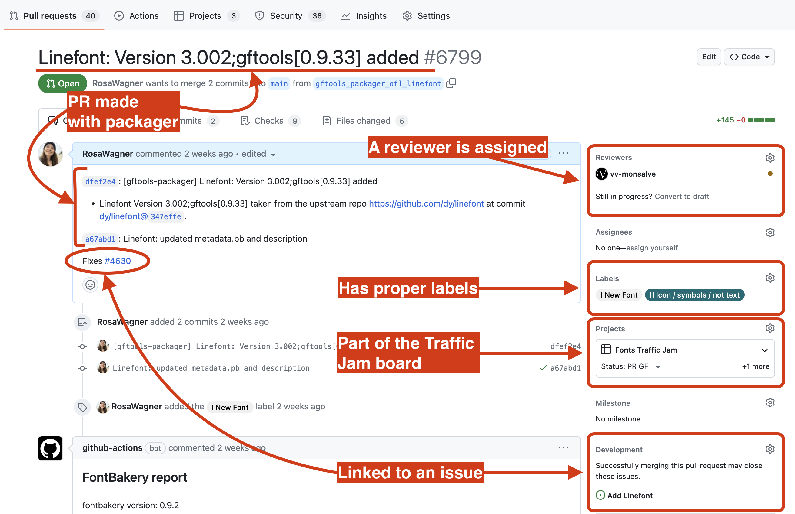
<figcaption aria-hidden="true">How a Pull request looks like</figcaption>
</figure>
<br>

#### Title and Comment section

Font files should always be packaged with [Packager](./package.md). The first comment and the title are generated by the tool and it ensures the font has been packaged by the Packager and not manually. 

Additional information can be added in the comment or the next to help the review. For example if something is expected to appear in the diff, it can save time for the reviewer to know about it in advance. E.g.: https://github.com/google/fonts/pull/6820#issuecomment-1741983529. 


#### Labels

Like issues, the PR must have labels to help understand the project and communicate within the team. These labels should be set by the onboarder onboarding the font.

1. All PRs should be labeled at least with a *primary category label* (starting with `I`). These labels are **grey** and inform about the **type of project**, typically: 

    - <mark class=grey>I New font</mark>: this family has never been released before, therefore we will be careful of the quality of the design and the aspect of the font that can't be changed later such as the vertical metrics and the weight distribution etc.
    - <mark class=grey>I Font upgrade</mark>: this family has been released in the past, therefore we will be particularly careful about potential regressions.
    - <mark class=grey>I Small fix</mark>: this is not an outstanding upgrade, it fixes a bug, we don't need to communicate about it on social media. Or amends a previous one that was merged but didn't hit production.
    - <mark class=grey>I Article/Description</mark>: doesn't modify a font file but the Description or Article files in the font directory.
     - <mark class=grey>I Metadata/OFL</mark>: doesn't modify a font file but the Metadata or license files in a font directory.
    - <mark class=grey>I Designer</mark>: concerns the designer directory.
    - <mark class=grey>I Knowledge</mark>: concerns the Knowledge platform.
    - <mark class=grey>I Lang</mark>: pull changes from the subtree repo [googlefonts/languages](https://github.com/googlefonts/lang)
    - <mark class=grey>I Axis Registry</mark>: pull changes from the subtree repo [googlefonts/axisregistry](https://github.com/googlefonts/axisregistry).
    - <mark class=grey>I Tools/workflow/repo</mark>: only affects the repository, it should not be tracked in Traffic Jam and its content should not be pushed to a server. For example, the PRs updating the push lists should be tagged with this label so it doesn't pollute the board.

2. The *secondary category labels* (start with `II`) are **dark green** and allow to add **mandatory additional information**. 
    
    When the primary language supported is a complex script (usually not Latin-Cyrillic-Greek), a dark-green label must inform us about it. This way the person checking the font in sandbox can make sure Latin is not displayed, but the actual primary script of the font: 
    
    - <mark class=darkgreen>II African</mark>
    - <mark class=darkgreen>II Arabic / Hebrew / Semitic / RTL</mark>
    - <mark class=darkgreen>II CJK</mark>
    - <mark class=darkgreen>II Indic / Brahmic / Thai / Tai</mark>
    
    We also use a dark-green labels to precise certain conditions/technologies that requires special attention such as:
    
    - <mark class=darkgreen>II Color font</mark>
    - <mark class=darkgreen>II Custom axes</mark>
    - <mark class=darkgreen>II Icon / symbols / not text</mark>

3. The *tertiary category labels* (start with `III`) are **orange** and allow to know more about the **type of upgrade**. Every <mark class=grey>Font upgrade</mark> issue should have an orange label:

    - <mark class=orange>III Expand glyphset</mark>
    - <mark class=orange>III Expand styles</mark>
    - <mark class=orange>III Improve rendering / layout</mark>
    - <mark class=orange>III VF Replacement</mark>  

#### Reviewer

The policy is that no one should merge their own PRs. Therefore a reviewer should be assigned to approve the PR before merging. They will make sure the PR is conform to the requirements described in this Guide and will report any issue with the PR.

They either approve and merge or ask for changes —and signal that with labels. 

1. If something is **wrong** with the PR, the **red** labels are used:

    - <mark class=red>-- Glyphset issue</mark>: a problem some glyphs from the font.
    - <mark class=red>-- Needs lang/glyphset update</mark>: an update from the language or the character set definition of the API (more info about the subtrees `lang` and `glyphsets` below).
    - <mark class=red>-- Needs Meta/Desc/License changes</mark>: problem with [METADATA.pb](./metadata.md), [ARTICLE.en_us.html or DESCRIPTION.en_us.html](./article.md) or [OFL.txt](./license-file.md) files.
    - <mark class=red>-- Needs upstream resolution</mark>: the issue can't be resolved without a fix in the upstream repository. 
    - <mark class=red>-- Regression</mark>: There are outstanding changes that need to be rollback or debated before merging. 
    - <mark class=red>-- API tofu</mark>: There would be tofu on the specimen page, either because a glyph from the sample text is missing from the font or the glyphset definition (nam files in `glyphsets` subtree), or because the sample text displays a glyph it shouldn't (textproto in `lang` subtree).

2. When in doubt, the reviewer can **call on someone else** or **ask for more details** to the onboarder with these **blue** labels:
    - <mark class=blue>-- Needs manager's opinion</mark>: This is to apply when Chris and/or Dave are the only one to make a decision about the issue. It is better to list these in the "Pipeline meeting" doc to be sure they don't remained unnoticed.
    - <mark class=blue>-- Needs Confirmation</mark>: Something curious/weird has been noticed and we need a confirmation from the onboarder that it is on purpose and thus can be approved and merged (or not).

#### Development (linked issue)

This is the section of the PR panel where we link an issue. Sometimes it doesn't work, in that case ["closing" words](https://docs.github.com/en/issues/tracking-your-work-with-issues/linking-a-pull-request-to-an-issue) can be used in the first comment. For example, "Resolves #465".

A Pull Request linked to an issue will automatically close the issue when the PR gets merged. Indeed we consider that when a project is part of the main branch of the GitHub repo, the issue is not actively worked on anymore by the onboarder. Except if there is a problem in sandbox (in which case we would re-open the issue), the family will end up in the API and this is not something to track along with the issues to do and in progress. As a reminder, this repository is first and foremost the workspace of the onboarders, it is not meant to give hint on releases to users. 

#### The Fontbakery report

A new PR will trigger the CI and output a Fontbakery report in comment of the PR. Ideally, there should not be any FAILs, and each WARN should be also checked to decide if they are irrelevant.

It is also required to justify any Fontbakery FAILS that should be ignored.

- If an exception is made, explain why and eventually link to an issue where it was discussed and approved.
- If it's a bug, link the issue reporting that bug to Fontbakery (create one if it doesn't exist).
- If you don't know what a specific FAIL means, ask for help in the comments.

Fontbakery has already some exception lists when it comes to [RFN](https://github.com/fonttools/fontbakery/blob/main/Lib/fontbakery/data/googlefonts/reserved_font_name_exceptions.txt) and [abbreviated font names](https://github.com/fonttools/fontbakery/blob/main/Lib/fontbakery/data/googlefonts/abbreviations_familyname_exceptions.txt) and [camel-cased font name](https://github.com/fonttools/fontbakery/blob/main/Lib/fontbakery/data/googlefonts/camelcased_familyname_exceptions.txt). If the family name of the font is added there, then the FAIL should not yield anymore (once next version of Fontbakery released).

#### The visual QA

You can find the downloadable artifacts under `checks > Google Fonts QA > qa`. This zip file consist in proof and diff images to ensure also a QA by a human eyes. 

<br>
<figure>
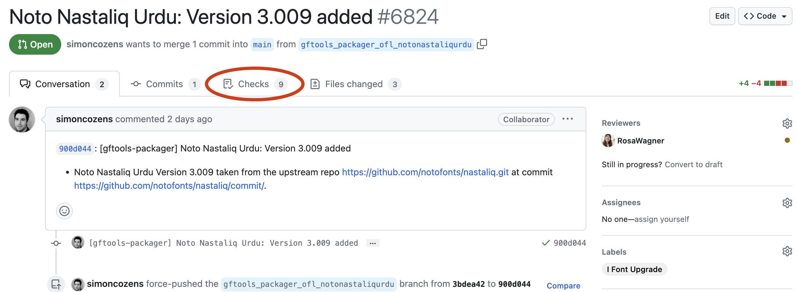
<figcaption aria-hidden="true">Checks Tab</figcaption>
</figure>

<br>

<figure>
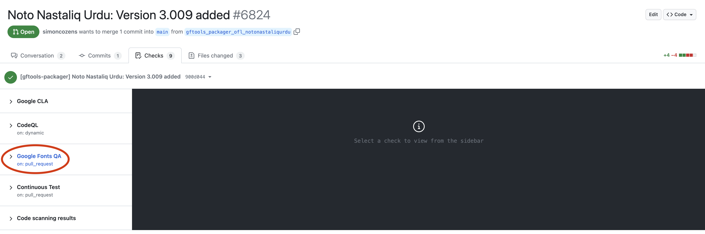
<figcaption aria-hidden="true">Google Fonts QA action</figcaption>
</figure>

<br>

<figure>
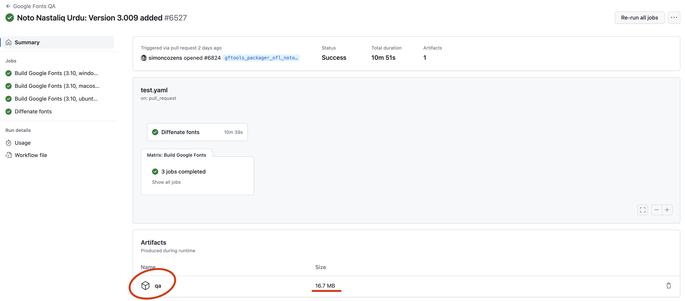
<figcaption aria-hidden="true">Zip file to download under the artifacts section</figcaption>
</figure>
<br>

Check new fonts with the proof reports:
- the design is consistent throughout all styles
- outlines are quality
- there are basic spacing and kerning
- nothing weird is happening

Check updated thanks to the diff reports:
- no text reflow
- no weight changes
- no glyphs missing
- no shaping bug introduced
- no major changes in the font tables
- no vertical metrics changes
- no weird unjustified changes

If an important regression is introduced, we should decide to either accept it and merge, or not accept it. For the latter the designer can be asked to roll out the change, or we can eventually onboard the font under a new family name.

#### Files changed

**[METADATA.pb](./metadata.md)**

Check even if there is no FAILs reported by font bakery.

- Check all fields to ensure they make sense:
    - classification is correct according to font 
    - no authors are forgotten (in case of fork, the original authors should be added except if they are against it)
    - if the font name has to be abbreviated, add a `display_name` field
    - if the origin of the VF correspond to the default in Axis Registry (mostly for `opsz` axis)
    - has primary script if non LCG script
    - all information looks correct and consistent
- If Noto:
    - is_noto = True
    - has primary script and languages
    - only Google listed as author

**[ARTICLE.en_us.html or DESCRIPTION.en_us.html](./article.md)**

To check even if no FAILs reported by font bakery.

- correct typos
- correct inconsistencies
- correct if written at the first person (should be at the third)
- correct if copywriting is indelicate, stereotyped or offensive (for example, "This family demonstrates a feminine energy with its fragile aspects" is unacceptable)
- Forked project should mention the original with a URL to the font on GF if it exists.
- Biography's element should be in the designer's bio
- Credits should be in the credit. We accept credits in the description if there are not mentioned in the credits section (for example, help on development, specific names of people involved if only a collective name is credited, etc.)

**upstream.yaml**
- is present
- if Noto, has article

**[OFL.txt](./license-file.md)**

Check the copyright string looks correct. 

### The lists

As said above, [google/fonts](https://github.com/google) repository content is directly linked to the dev-sandbox replicating [fonts.google.com](https://fonts.google.com). Every week an engineer from the Fonts team, on call for two weeks, will be responsible to *push* the changes introduced into the dev-sandbox towards the sandbox server, and the changes introduced into the sandbox towards the actual live server. 

An onboarder on call is in charge of notifying the engineer on call about the changed paths in the directory using what we call a "push list". These are text files directly used by an internal script to push the changes. 

1. The [to_sandbox.txt](https://github.com/google/fonts/blob/main/to_sandbox.txt) file lists the path that are ready to go to the sandbox servers.

2. The [to_production.txt](https://github.com/google/fonts/blob/main/to_production.txt) file lists the path that are ready to go to the live server after being validating in sandbox.

3. The [to_delists.txt](https://github.com/google/fonts/blob/main/to_delist.txt) file lists all the files that we want to remove from the repository and that should not be displayed on [fonts.google.com](https://fonts.google.com) anymore. This file is not linked to any script though, completing it demands a manual intervention from the on call engineer.

A list looks like that:

```code
# New
ofl/notosanskawi # https://github.com/google/fonts/pull/6469
ofl/playpensans # https://github.com/google/fonts/pull/6746


# Upgrade
ofl/biorhyme # https://github.com/google/fonts/pull/6737
ofl/notosanscaucasianalbanian # https://github.com/google/fonts/pull/5281
ofl/notosanselymaic # https://github.com/google/fonts/pull/5283


# Metadata / Description / License
ofl/balsamiqsans # https://github.com/google/fonts/pull/6805
ofl/redrose # https://github.com/google/fonts/pull/6805

# Axis Registry
axisregistry/ar_retinal_resolution.textproto # https://github.com/google/fonts/pull/6663

# Lang
lang/languages/ae_Avst.textproto # https://github.com/google/fonts/pull/6573
lang/languages/af_Latn.textproto # https://github.com/google/fonts/pull/6468
```

Two tools are needed to prepare these lists.

#### The push module

The push module is used to organize the Traffic Jam board, i.e., update the PR status and tag the proper list in order to prepare the generation of the push lists text files. 
Everything that the push module does, you can do it manually from the Traffic Jam board —but it take ages.

- It updates the server status automatically by comparing the font versions in the different servers.
- ** TO DO MARC**
- ** TO DO MARC**
- ** TO DO MARC**


#### `gftools gen-push-lists` script

A script from gftools is used to generate the push lists text files. Make sure your main branch is in sync and run `gftools gen-push-lists path/to/fonts/repo`.

The script reads the Traffic Jam board to collect information:

- The PR labels allow to sort it by type of project. 
- The PR URL is used to know what change was introduced and when.
- We push font directories and textproto files.
- If the script detect deleted path, it will mute these lines and they can then be copy-pasted into the `to_delist.txt` file.

Once the list are created, it should be pushed to [google/fonts](https://github.com/google) thanks to a PR on another branch with a label <mark class=grey>Tool / Workflow / Repo</mark>. Chris should be assigned to review the PR and he will merge it. 

Once the PR updating the list is merged, the on-call team should be notified by message in the group chat. 

Most of the time the on-call engineer will push the text list without reading it, and they will push the entire font directory whether the change concerns only one file or many. 

For example, pushing a change to an article, description, metadata, or license file will result in re-pushing the font family. This can become tricky in the following situations:

- A change to a font file is blocked in sandbox waiting to be fixed before going further. Pushing further the PR that changes a non-font file would also push the blocked change of the font file.
- The font directory was added retrospectively. This is the case for the old families before the existence of the google/fonts repository. It often happens that the `METADATA.pb` from these families were manually made and are containing errors such as an inconsistent family name with the font name key in `METADATA.pb` (e.g., an inconsistency such as `FontName` and `Font Name` would result in pushing a new family into the API). So even when only modifying a non-font file, the Fontbakery report should be read carefully.

### Checking the dev/sandbox/prod

It is necessary to check each pushed family to make sure that indeed the change was pushed, that it is displayed correctly, and to double-check previous QA before sending to prod. Most problems could be avoided with a thorough QA before merging, but errors can always happen and the API has the advantage to reflect data errors visually.

- We usually check the dev-sandbox if we are in an experimenting phase with a special font family. 
- We must check the sandbox after each push to sandbox and before preparing the to production list.
- The live server can be checked very briefly after a prod push. It is a good opportunity to select the new fonts and the important upgrades to create a "share" link with the stakeholders and the user community on tweeter.

    Example:

    ```code
    🐔 Google font news!

    🐣 New fonts this month
    Borel, Dai Banna SIL, Handjet, Lisu Bosa, Narnoor, Noto Sans Vithkuqi, Noto Serif Vithkuqi, REM, Noto Sans Cypro Minoan, Noto Serif Khitan Small Script, Tektur, Victor Mono

    https://fonts.google.com/share?selection.family=Borel|Dai+Banna+SIL|Handjet|Lisu+Bosa|Narnoor|Noto+Sans+Vithkuqi|Noto+Serif+Vithkuqi|REM|Noto+Sans+Cypro+Minoan|Noto+Serif+Khitan+Small+Script|Tektur|Victor+Mono

    🐥 Upgraded fonts this month
    DM Sans, Joan, Sen, Figtree, Signika, Nuosu SIL, Bangers

    https://fonts.google.com/share?selection.family=DM+Sans|Joan|Sen|Figtree|Signika|Nuosu+SIL|Bangers
    ```

#### Home page

- No Tofu
- The proper Primary script is displayed

#### Specimen

-   Primary script is displayed first
-   No tofu
-   All expected instances (every 100) are displayed and look okay
-   No any kind of weirdness
-   Font style matches category

#### Type Tester

-   No tofu
-   All axes work
-   No interpolation issue on the few glyphs displayed

#### Glyphs

-   Primary script first
-   Latin style matches the primary script style

#### About&License

-   Not empty
-   No typos
-   Correct bios
-   No missing elements (image, URL, etc)

#### Download button

-   Package is downloadable
-   if new opsz axis: the static locations are consistent with the VF STAT table.

### Relationship between GF / Lang / Glyphsets / Axis Registry

Above we noted that the API could display the font incorrectly. This is because the Google Fonts API doesn't rely uniquely on the google/fonts repository. 

These are the thee subtrees on which an onboarder can interact and what they allow the API to do:
- [Lang](https://github.com/googlefonts/lang): Displays the correct sample texts in the specimen page and the main view
- [Glyphsets](https://github.com/googlefonts/glyphsets/tree/main/Lib/glyphsets/encodings): Subsets efficiently the font and show an overview of the font's character set in the glyphset page
- [Axis Registry](https://github.com/googlefonts/axisregistry): Display the proper axes of variable fonts in the font tester page. 

#### Lang repo

The lang repo contains textprotos to define [script](https://github.com/googlefonts/lang/blob/main/Lib/gflanguages/data/scripts), [regions](https://github.com/googlefonts/lang/tree/main/Lib/gflanguages/data/regions) and [languages](https://github.com/googlefonts/lang/tree/main/Lib/gflanguages/data/languages).


- The **scripts** directories contain textprotos with two keys, a script name and a script ID.

    E.g., `scripts/Arab.textproto`

    ```code
    id: "Arab"
    name: "Arabic"
    ```

    This ID can be reflected in the font's `METADATA.pb`, to indicate the API to display the font's "primary script" over all the other available scripts contained in the font.

    E.g., `primary_script: "Arab"`

    <br>
    <figure>
    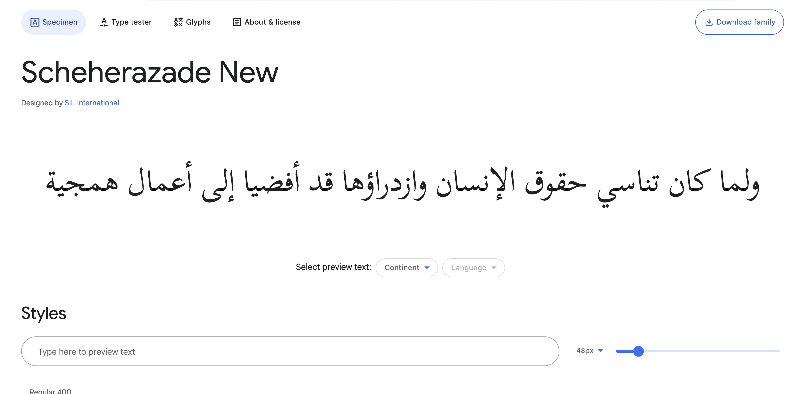
    <figcaption aria-hidden="true">Scheherazade New displaying Arabic script by default instead of Latin (random language selection or user's country specific).</figcaption>
    </figure>
    <br>

- The **languages** directory contains textprotos which define several key entries for a specific language, but also the sample texts displayed in the specimen page. Each defined language uses the script ID to know to which script this language is linked to.

    E.g., `languages/arz_Arab.textproto`

    ```code
    id: "arz_Arab"
    language: "arz"
    script: "Arab"
    name: "Egyptian Arabic"
    population: 66639360
    region: "EG"
    sample_text {
    masthead_full: "الإع"
    masthead_partial: "نم"
    styles: "الإعلان العالمي لحقوق الإنسان، المادة الأولانية"
    tester: "الإعلان العالمي لحقوق الإنسان، المادة الأولانية البني أدمين كلهم"
    poster_sm: "الإعلان العالمي"
    poster_md: "الإعلان"
    poster_lg: "الإعلان"
    specimen_48: "الإعلان العالمي لحقوق الإنسان، المادة الأولانية البني"
    specimen_36: "الإعلان العالمي لحقوق الإنسان، المادة الأولانية البني أدمين كلهم مولودين حرين ومتساويين في الكرامة والحقوق. إتوهبلهم العقل والضمير، والمفروض يعاملوا بعض بروح الأخوية."
    specimen_32: "الإعلان العالمي لحقوق الإنسان، المادة الأولانية البني أدمين كلهم مولودين حرين ومتساويين في الكرامة والحقوق. إتوهبلهم العقل والضمير، والمفروض يعاملوا بعض بروح الأخوية."
    specimen_21: "الإعلان العالمي لحقوق الإنسان، المادة الأولانية البني أدمين كلهم مولودين حرين ومتساويين في الكرامة والحقوق. إتوهبلهم العقل والضمير، والمفروض يعاملوا بعض بروح الأخوية.الإعلان العالمي لحقوق الإنسان، المادة الأولانية البني أدمين كلهم مولودين حرين ومتساويين في الكرامة والحقوق. إتوهبلهم العقل والضمير، والمفروض يعاملوا بعض بروح الأخوية."
    specimen_16: "الإعلان العالمي لحقوق الإنسان، المادة الأولانية البني أدمين كلهم مولودين حرين ومتساويين في الكرامة والحقوق. إتوهبلهم العقل والضمير، والمفروض يعاملوا بعض بروح الأخوية.الإعلان العالمي لحقوق الإنسان، المادة الأولانية البني أدمين كلهم مولودين حرين ومتساويين في الكرامة والحقوق. إتوهبلهم العقل والضمير، والمفروض يعاملوا بعض بروح الأخوية.الإعلان العالمي لحقوق الإنسان، المادة الأولانية البني أدمين كلهم مولودين حرين ومتساويين في الكرامة والحقوق. إتوهبلهم العقل والضمير، والمفروض يعاملوا بعض بروح الأخوية.\nالإعلان العالمي لحقوق الإنسان، المادة الأولانية البني أدمين كلهم مولودين حرين ومتساويين في الكرامة والحقوق. إتوهبلهم العقل والضمير، والمفروض يعاملوا بعض بروح الأخوية."
    }
    ```

    Therefore if a font's `METADATA.pb` has a defined primary script key, it should be possible to access all the language specific to that script in the specimen page of the API.

    <br>
    <figure>
    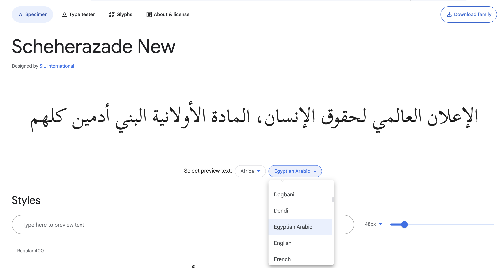
    <figcaption aria-hidden="true">Scheherazade New displaying Egyptian Arabic instead of Arabic from another language.</figcaption>
    </figure>
    <br>

    It happens that a font contains only glyphs specific to a certain language of a script, and not all the languages of that script. It is the case for the Noto collection and some fonts from SIL. In this case, the languages are also defined in the font's `METADATA.pb` to avoid displaying tofu on the specimen page and prevent users from selecting a language that is not supported by the font.

    E.g., `languages: "arz_Arab"  # Egyptian Arabic`

- The important keys in the textprotos of the **regions** directory are the region `ID` —which links the region to a language— and the `region_group` which is mirrored in the continent selection menu on the specimen page.

    Eg. `regions/EG.textproto`

    ```code
    id: "EG"
    name: "Egypt"
    population: 104124000
    region_group: "Africa"
    ```

    <br>
    <figure>
    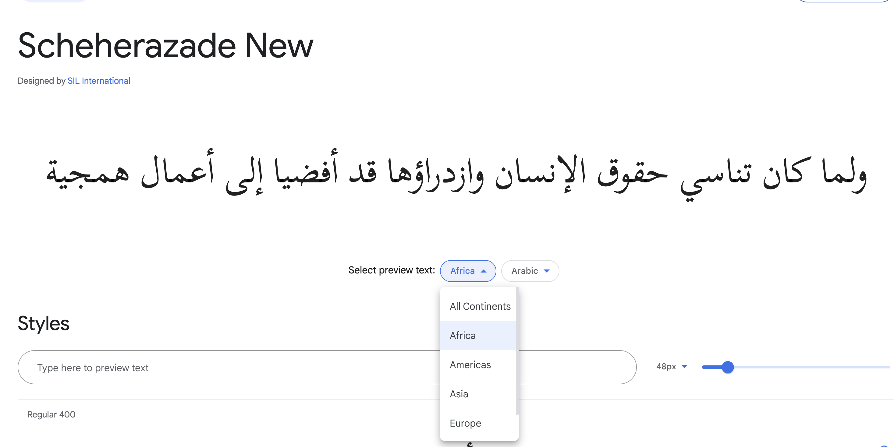
    <figcaption aria-hidden="true">Regions textprotos reflect on the continent selection menu on the API</figcaption>
    </figure>
    <br>

It happens that some languages don't have any sample text defined. We can either update the language textproto, or add a `sample_text` entry in `METADATA.pb` which would override any existing sample text. This absence of sample text for a script without the addition of a custom one in `METADATA.pb` would result in an empty specimen page.


#### Glyphsets repo

- **Subsets definition for the API**

    The `subsets` keys in a font's `METADATA.pb` refers to the `nam` files in [Lib/encoding/glyphsets](https://github.com/googlefonts/glyphsets/tree/main/Lib/glyphsets/encodings). These files determine how a font will be subsetted, meaning that if a glyph is not in a defined subset, it won't be accessible in the API. In addition, if a certain subset is missing from `METADATA.pb`, all the glyphs of that subset will be removed from the font served by the API.

    These subsets are visually reflected on the UI through the filters, where we select "languages" (which are actually scripts).

    <br>
    <figure>
    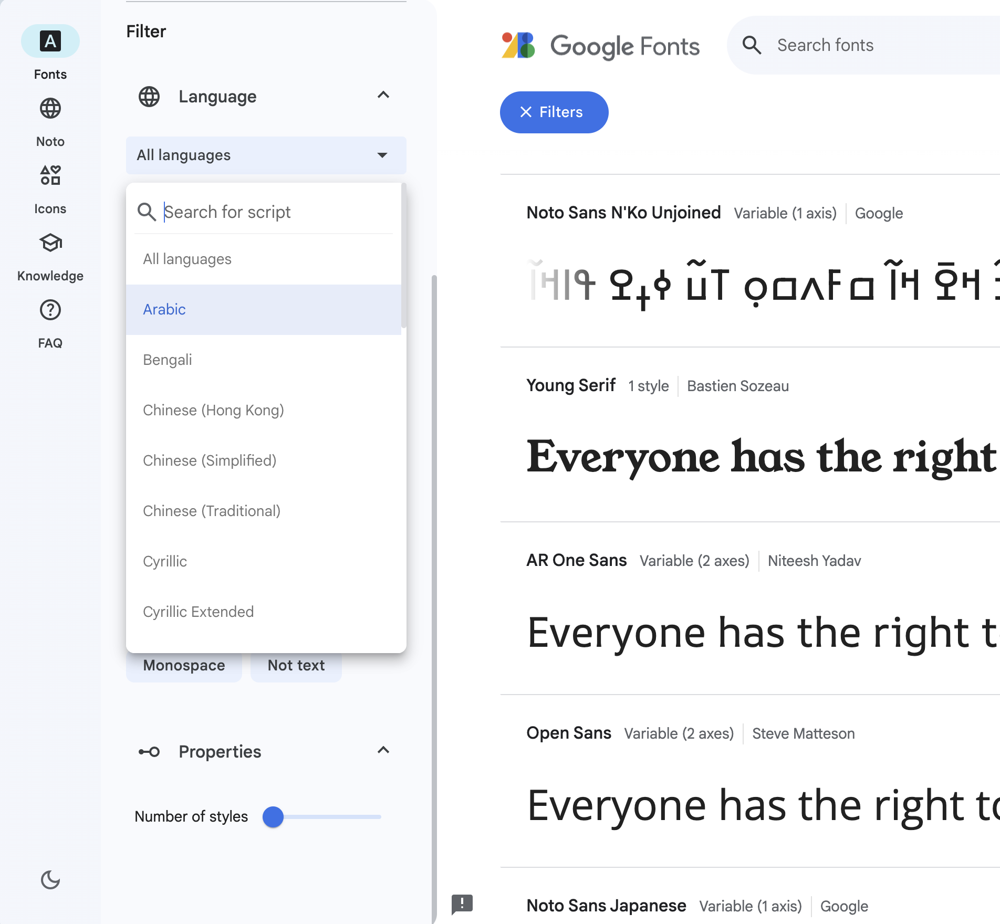
    <figcaption aria-hidden="true">Scripts menu in Filters</figcaption>
    </figure>
    <br>

    The problem is that this database is a copy of the internal one used by the API. Therefore it can be easy to not be in sync anymore. So when we notice an important glyph is missing from a `nam` file, we follow this process:

    1. Add the codepoint to the file
    2. Assign the engineer on-call to review and merge
    3. Once merged, re-push the family to sandbox and prod


- **Glyphsets for designers**

    The glyphsets in `GF_Glyphsets` are meant for the designers and specific glyphset expectation from Google Fonts, but it has no influence on the API, nor `METADATA.pb`.

    We need to be careful when upgrading them though, cause we don't want to have a inconsistent requirement. Also the Noto fonts (non-LCGD) include automatically `GF_Latin_Core`; if a glyphs gets removed from the character set definition, it will be removed from the next update of the Noto families.

- The `glyphsets` (both the API subset and the designers minimal sets) is used as a module in different QA tools. Among other checks, Fontbakery checks that all LCG fonts support at least `GF_Latin_Core` glyphset, and all complex scripts support at least `GF_Latin_Kernel`.


#### Axis registry

The Axis Registry defines:

- The supported axes by Google Fonts API.

    <br>
    <figure>
    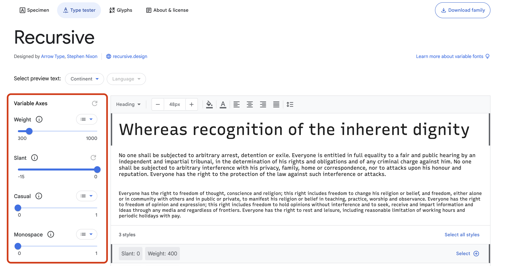
    <figcaption aria-hidden="true">Type tester page with sliders</figcaption>
    </figure>
    <br>

- The snippet-information about each axis.

    <br>
    <figure>
    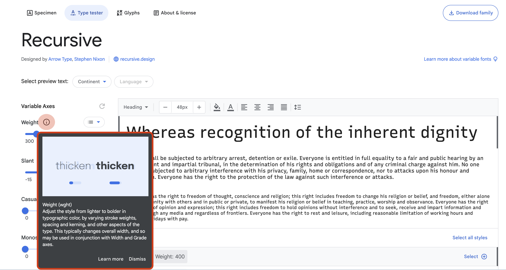
    <figcaption aria-hidden="true">Axis information</figcaption>
    </figure>
    <br>

- The instances served by API.

    <br>
    <figure>
    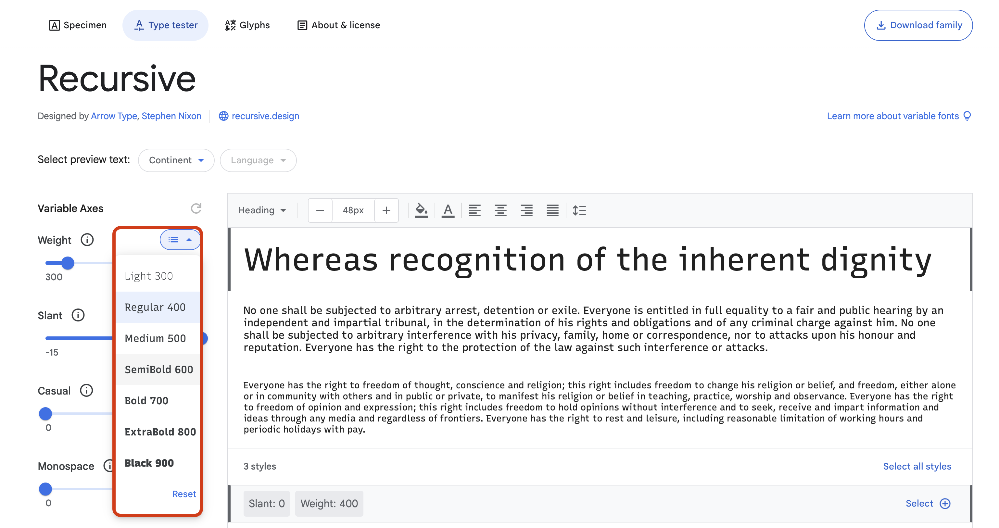
    <figcaption aria-hidden="true">Available instances</figcaption>
    </figure>
    <br>

- The static instances that will be provided in the zip file:

    <br>
    <figure>
    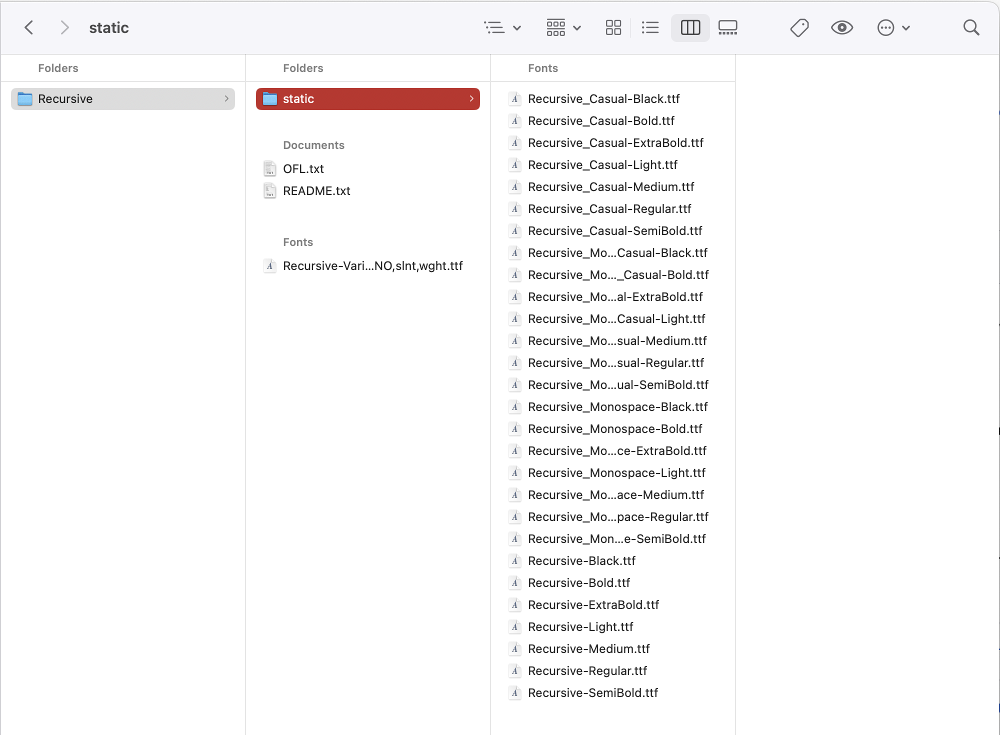
    <figcaption aria-hidden="true">Downloadable zip file</figcaption>
    </figure>
    <br>

You know if an axis was correctly implemented by checking [fonts.google.com/variablefonts](https://fonts.google.com/variablefonts).

Find everything you need to know about the Axis Registry and the registration protocol in this [chapter](./axis-registry.md).

#### Releases and pull subtree

1. We need regular releases because these subtrees are also modules used by gftools and Fontbakery. For example, if Fontbakery fails a font because it doesn't display all glyphs of the language's sample text (although the codepoint is part of a nam file) then it can mean that there is no recent release of the glyphsets package.

2. Changes to the `Lang` and `Axis Registry` repo need to be pulled into the `google/fonts` repo. The ideal would make a pull subtree at each release of the module to make the sync easier to verify.

    From your local `google/fonts` clone, run:

    `git subtree pull --prefix=axisregistry https://github.com/googlefonts/axisregistry.git main`

    or

    `git subtree pull --prefix=lang https://github.com/googlefonts/lang.git main`

    Once the main branch from the submodule is pulled, you will need to commit and push in a new branch upstream. Label the PR appropriately <mark class=grey>Axis Registry</mark> or <mark class=grey>Lang</mark> so it gets sorted correctly in the Traffic Jam board.

    **Important:** When merging a pull request in the google/fonts repo which contains a subtree pull, merge it using the "Create a merge commit" button and not the "Squash and merge" button. If we squash and merge, the subtree's history is squashed into a single commit which will cause merge conflicts for the next person who has to do a subtree pull. 
