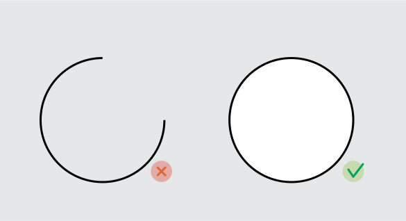
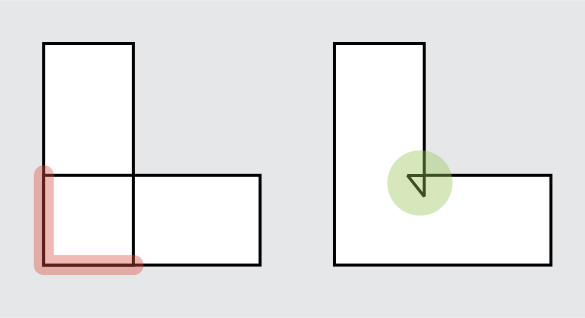
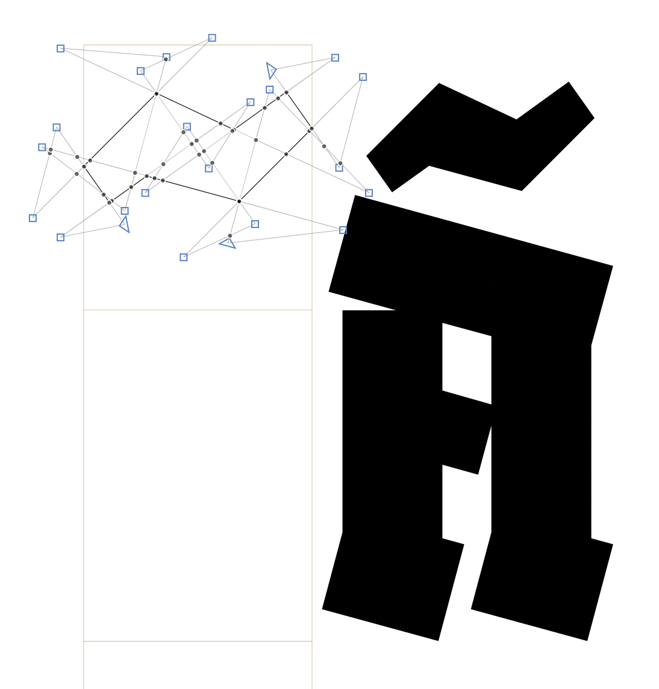
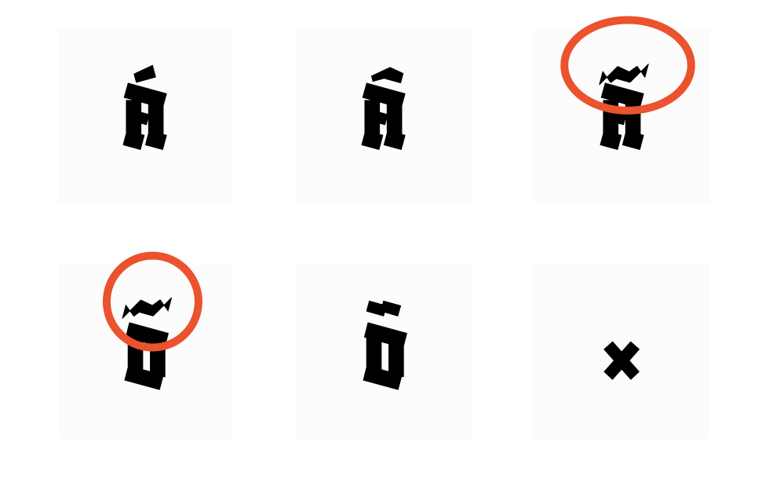

<link href="style.css" rel="stylesheet">

<a href="./index"><button class="button button-i">&larr; GF Guide Index</button></a>

# Outline Quality
{:.no_toc}

🐸  Make sure your font is ready for production by fulfilling the check-list below. Design is not particularly judged here, we are talking from the point of view of the technical quality aspect of a font, i.e: OS, browsers, apps and printers will be able to read the font file and display it as the designer intended.
  
Note that some font editors or export tools will partly do the job for you. Always test your exported fonts in different environments, open them in a font editor, or run a Fontbakery report on them, to make sure that everything looks like what you want.
  
This guide will give users a short introduction to font’s outline from a technical perspective. With that knowledge, we will see how to prepare them so they appear the best on screen.

    Background reading: 
    <mark class="green"><b>must&rarr;</b></mark> <a href="https://googlefonts.github.io/gf-guide/requirements.html#glyphsets)" style="font-weight:bold">Overall font files requirements/Glyphsets</a>

## Table of contents
{:.no_toc}
* TOC goes here
{:toc}

## Basic terminology

A `glyph` is a representation of a `character` in terms of shape and design. In digital type design, we usually draw glyphs using `vector graphics`; the ones called `Bézier curves`. The vector graphics have that advantage of preserving their shapes whatever the rendering size, because they are described by `points coordinates`, that can be scaled up and down without loosing any information. But remember, vectors are just *numbers*. What you see is the `rendering` of vectors graphics. On screen, they need to be translated into pixels —this is called the `rasterization process`— and in print, they need to be translated into `points` —actual `dots`.

A `Bézier curve` is a `segment` whose length and position is defined by of two points called `on-curve` points. The curvature of that segment is controlled by additional points called `off-curve points` (because they are *off* the curve), or `control points` (because they *control* the curvature). Their position is relative to an on-curve point. Hence why they are often represented as small `handles` linked an on-curve point. A `curve-sergment` has a curvature and therefore off-curve points, a `line-segment` is flat and therefore doesn’t need off-curve points.

The number of off-curve points will depend on the `curve type`. `Cubic curves` are controlled by two off-curve points, while `quadratic curves` are controlled by one off-curve point. In some cases, TT curve omit in-between smooth connections, and the segment appears to have two on-curves points and multiple connected off-curve points; but don’t get fooled, these implicit on-curve points will appear after converting to cubic curve.

A `path` is made of multiple connected segments. That is why the on-curve points are actually called `nodes` (because they *tie* segments together). A set of connected path is called a `contour`. A `component` is a reference to a glyph inside another glyph. A `composite glyph`, is a glyph made of components only. The set of contours and components that defines the shape of a glyph is called the glyph’s `outline`. The font’s outlines are the collection of all the outlines of one font.

A `smooth connection` is an instruction given to a node, to make inter-dependent (ie. aligned) the two off-curve points. The two connected segments then look like one curve, and the line created by the two handles become the `tangent` of this curve. That is why a node with a smooth connection is also called a `curve-point`. If the off-curve points are not aligned, and are not instructed to stay aligned, or if there is no off-curves point at all, then the connection of the two segment can create a corner. Hence the `corner-point`.

Contours have a `direction` which is given by the `order` or the `index` of the points. For example, for a segment defined by a *point*&ensp;0 (*x*0,*y*0) and a *point*&ensp;1 (*x*1,*y*1); if *y*1 &#60; *y*0 and/or *x*1 &#60; *x*0 then the direction of the path is clockwise. The contours direction is fairly important since it gives instructions to the `rasteriser` to render shapes as full/black (the `outer-form`) or empty/white (the `counter-form`). The rule is that the counter-form goes in the opposite direction of the outer-form.

`Hinting` is an added layer of instruction given to outlines for rasterisers to render a font properly on screens at small sizes; when coordinates of points (usually referred in a plan of 1000 units) have to be scaled down to a grid of few pixels. The `hints` will help the rasteriser to guess where in this grid the points need to be placed to preserve the legibility of the glyph and the consistency of the font design (horizontal alignments and average stems thickness).

`TrueType (TT)` curves are quadratic curves which direction is clockwise for the outer-form, and counter-clockwise for the counter-form. In opposition, `PostScript(PS)` curves are cubic curves which direction is counter-clockwise for the outer-form, and clockwise for the counter-form. TT fonts `(.ttf)` and PS fonts `(.otf)` are both `OpenType` fonts (`OTF`), but they use different `compression` and rendering strategies.

To reduce the file size, TT fonts use `TrueType compression` which makes the most of components: these are glyphs stored to be re-used in other glyphs to avoid duplication of information. PS font use the `CFF compression`, this is similar to component although not entire glyphs are stored but path (or contours parts). This means that an export to the `OTF-CFF format`(.otf) will cause the decomposition of the source’s components —as opposed to `OTF-TTF` format (.ttf).

To improve rendering, Windows’ rasterizer reads `TrueType hinting`, Apple's built-in rasterizer ignore most hinting instructions, and Adobe uses its own which prefers `PostScript hinting`. In short and without further details, TT fonts target Microsoft apps and the web in general, and PostScript fonts target Adobe apps and the printing world in general.

## Preparing your outlines: a pre-production process.

### Segments

-   **Mixed outline type:** The outlines of one font must be either PostScript (OpenType Fonts font with CFF compression / .otf) or TrueType (OpenType Fonts with TrueType compression / .ttf). It never happens anymore with recent font editors, but Fontlab 5 allowed mixed curve types within the same glyph, so beware. Also know that you shouldn’t have mixed curve types within the same font files, hence the next point.
-   **Wrong direction:** We usually use PS curves for design, and they are then converted to TT when exporting TTF fonts. Whatever the chosen outlines, make sure their direction is following the chosen curve-type across the entire family.
-   **Almost straight:** If a segment is misaligned by one or two units, it may be a mistake from the designer. This small offset can cause a big misinterpretation from the rasterizer at small ppm sizes.
-   **Missing inflection point:** a curve has a “suspicious inflection” when it is a single segment going from convex to concave (or vice versa). We need to divide this segment by adding a node at the point where the curve is changing condition, therefore the tangent represented by the two handles crosses the curve.
-   **Collinear:** If two straight line-segments are connected with the same angle (or almost the same angle), or with a slight offset, it means that the entire line could be made with one segment (two points, not more).
-   **Short:** Segments of 1 or 2 units are often used to make ink traps, but they are also sometimes unwanted and, again, can be badly rendered on some screens.
-   **Open:** A contour can only be functional if it has a closed path, otherwise, it won't be rendered at all.

    <figure>
    
    </figure>
-   **Overlaying:** It disturbs rendering, interpolation and variation.

    <figure>
    
    </figure>
-   **Overlapping:** The crossing of two independent contours is not such a problem in variable fonts, and generally merged during the generation of static binaries. If you want to control the result of the merging, it is better to do it yourself. If not, try to keep not-too-small-not-too-big overlapped area. Also try not to overlap more than 2 contours in the same area (contour crossing a contour itself crossing another contour creates confusion during generation and rendering). In any case, try to avoid overlapping shapes which cross a plain shape and a closed counter-shape (typically, Oslash should be manually merged for example).
-   **Self-crossing:** Often known as open-corners, it is very helpful while designing and recommended for nice interpolations. They will be preserved for VF fonts and merged during generation to static binaries. To better control the result, pay attention to the size of it (not too big, not too small) as well as not leaving portions of it outside the main shape like the stem, since it can cause unwanted rendering issues. If you want to control the result of the merging, do it yourself, if not, the same advice as above.

### On-curve points (nodes)

-   **Overlaying:** Also called “empty segments” because they don't have a length. They are often useless and sometimes confusing for hinting and rendering — except for some rare cases of variations.
-   **Missing extrema:** Hints are either vertical or horizontal, so they can only get hooked on nodes at the extremum of one curve. Also, by having them you could control better the curves and probably reduce the need for extra nodes.
-   **Fractional coordinates:** For example `3.14159`, also called “floating point coordinates” or “floats”. It is a generally accepted best practice and Google Fonts requirement to only use integers. Hints can only be applied to integer coordinates.
-   **Broken smooth connection:** Ensure the right type of node according to the connection, smooth (between to curve segments) or sharp (between a curve and a line segment; or two line segments)

### Off-curve points (handles)

-   **Almost straight:** When a handle is off the node alignment from one or two units, it is most likely a mistake from the designer. The curve may appear weird when scaled down because of some coordinate rounding, nothing really bad, but that is why QA tools often report this.
-   **At same coordinate as node:** So called “zero handles” or “zero-length handles” because of their coordinates is 0 (from the node).
-   **Fractional coordinates:** For example `3.14159`, also called “floating point coordinates” or “floats”. It is a generally accepted best practice and Google Fonts requirement to only use integers.

### Components

-   **Transformed components:** It can happen that transformed components ((scaled, mirrored, stretched, rotated) are not processed correctly while generating variable ttf. This could cause issues like the original component is displayed instead, or unwanted fractional coordinates, as well as the wrong direction in outlines. Fontmake is supposed to decompose them during export, but the conversion of transformed outlines to quadratic curves could cause more quality issues.
-   **Nested components:** Components referring to another component (nested, one inside the other) are not correctly interpreted by postscript printers.
-   **Overlapping components:** While generated ttf static binaries, Fontmake doesn't decompose overlapping components (except if one is transfomed), which is good for Variable Fonts but can cause some issues in static TTF for some renderers and printers. We therefore recommend to decompose at least one of the component, so it triggers the decomposition of the entire glyph during generation (and merging of overlapped contours for statics).

# Don’ts

## Over-complex outlines

Unless absolutely necessary, avoid over-complicated outline drawing. One example is the excessive use of *outside open corners*. They may come in handy in many cases, but over-stressing the algorithm responsible for removing them upon generating may lead to adverse effects.

👻 If you do end up using special outline construction, pay extra attention to how those glyphs end up rendered in the final fonts.

<figure>

<figcaption aria-hidden="true">This outline construction of the <em>tilde</em> is theoretically possible and looks acceptable in Glyphs but will break the responsible generator filter.</figcaption>
</figure>

<figure>

<figcaption aria-hidden="true">What looks nice in Glyphs leads to this result in the generated fonts.</figcaption>
</figure>

<figure>

<figcaption aria-hidden="true">Attempting to remove the overlaps manually in Glyphs leads to this appearance.</figcaption>
</figure>

------------------------------------------------------------------------

## Useful links

-   [Drawing good paths](https://glyphsapp.com/learn/drawing-good-paths), Glyphs tutorial
-   [Drawing Vectors for Type & Lettering](https://ohnotype.co/blog/drawing-vectors), Blog post by James Edmondson
-   [Fontlab’s article about curve types](https://help.fontlab.com/fontlab-vi/Curve-Types/)
-   [Fontlab’s article about contours](https://help.fontlab.com/fontlab-vi/Contours/#terminology)
-   [Apple’s article about digitizing letterforms](https://developer.apple.com/fonts/TrueType-Reference-Manual/RM01/Chap1.html#points)
-   [About diacritics](https://glyphsapp.com/learn/diacritics), Glyphs tutorial
-   [How to draw with FontForge](http://designwithfontforge.com/en-US/Using_the_Fontforge_Drawing_Tools.html), FontForge tutorial

    Further reading: 
    <mark class="yellow">learn</mark> <a href="./diacritics">Diacritics</a>
     
    <mark class="green"><b>must&rarr;</b></mark> <a href="./testing">QA - Local testing</a>

