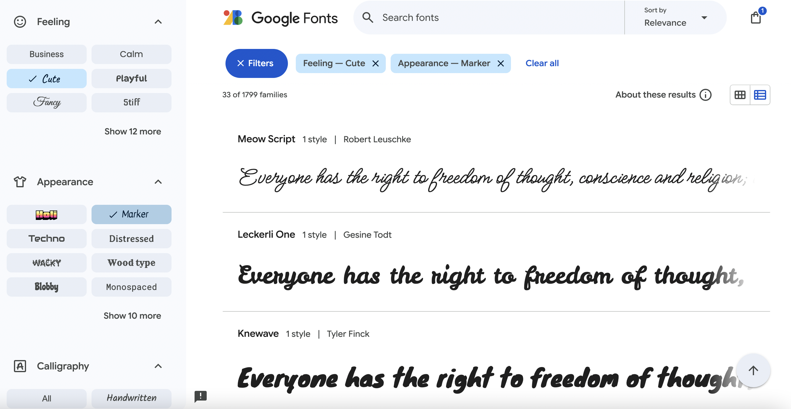
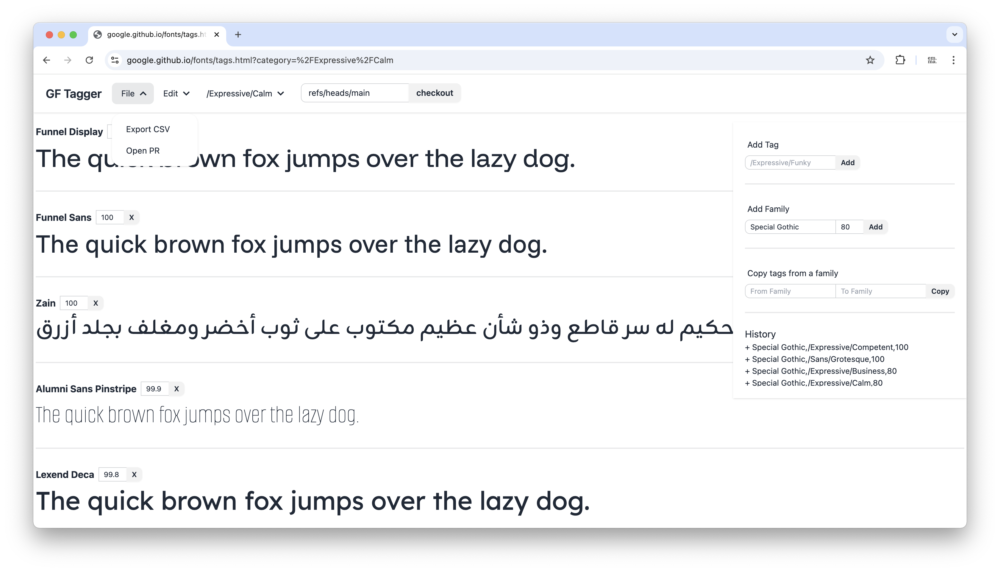
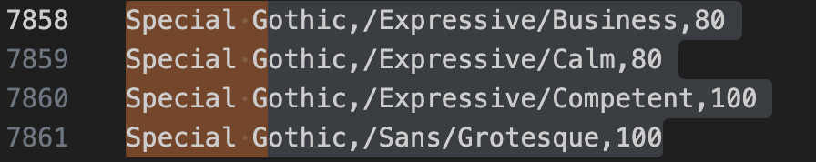
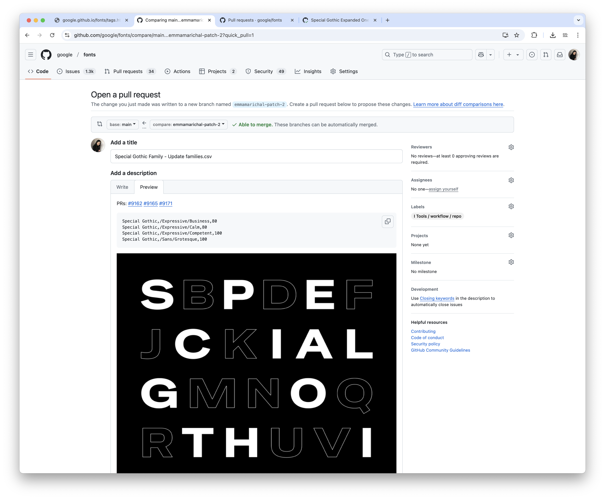

<link href="style.css" rel="stylesheet">

<a href="./index"><button class="button button-i">&larr; GF Guide Index</button></a>

# Tagging process
{:.no_toc}

🐝 Since 2024, you can find different typographic categories on <a href="https://fonts.google.com/">Google Fonts</a> , making it easier to sort fonts and allowing users to refine their search.

A new step has therefore been added to the font onboarding process, managed by the font onboarders, involving the use of a specially designed tool to facilitate the addition of tags.

    Background reading: 
    <mark class="purple">nerd&nbsp;</mark> <a href="./googlefonts">google/fonts repository explained</a>
     
    <mark class="purple">nerd&nbsp;</mark> <a href="./making-pr">Making a PR to Google Fonts</a>

## Table of contents
{:.no_toc}
* TOC goes here
{:toc}

## How tags are working?

The user can now select a selection of tags from the filters, categorized into different main groups:

- **Feeling** 
- **Appearance**
- **Calligraphy**
- **Serif**
- **Sans Serif**
- **Technology**
- **Seasonal**

The selected categories and the number of fonts matching these criteria are then displayed at the top of the selection.

 
<figure>

<figcaption aria-hidden="true">Google Fonts homepage (March 2025)</figcaption>
</figure>
 

## The process

The addition of tags to a new font is done when the PR for the font is ready on the Google Fonts repo, just like for designer profiles. Typically, between 2 and 6 tags are assigned per font, aiming to diversify the types of tags (each font would have at least one or two filters based on appearance or feeling, and a tag related to serifs, for example). After selecting a tag, such as `Cute`, a percentage must then be defined to sort the fonts relative to one another. *GF Tagger* displays a list of fonts associated with each tag, allowing for comparison and proper assignment of values.

**How to define tags for a new font?**

1. Open [GF Tagger](https://google.github.io/fonts/tags.html), and keep the font beside to have the design in mind.
2. In `Add Family`, add the name of the new font family your are tagging.
3. Pick a tag you need to define the font, and add a value next to the font family name. By adding it, you will see it appears as a line, in `History`.
Reproduce this step as many time you need tags. 
 
<figure>

<figcaption aria-hidden="true">GF Tagger (March 2025)</figcaption>
</figure>
 
4. Once you have all the tags you need, do `Export CSV` and copy past the lines corresponding to your font.
 
<figure>

<figcaption aria-hidden="true">CSV file (families.csv)</figcaption>
</figure>
 
5. In GF Tagger, clic on `Open PR`, and copy paste your values on the CSV file. Be careful to add them in an alphabetical order.
 
<figure>

<figcaption aria-hidden="true">CSV file to update</figcaption>
</figure>
 
6. Commit your changes and open a pull request, with some additionnal informations useful for the reviewer (font PR corresponding, image of the font, etc.)
 
<figure>

<figcaption aria-hidden="true">PR to open on the GF repo</figcaption>
</figure>
 

Here you can find a demo, showing more features.

